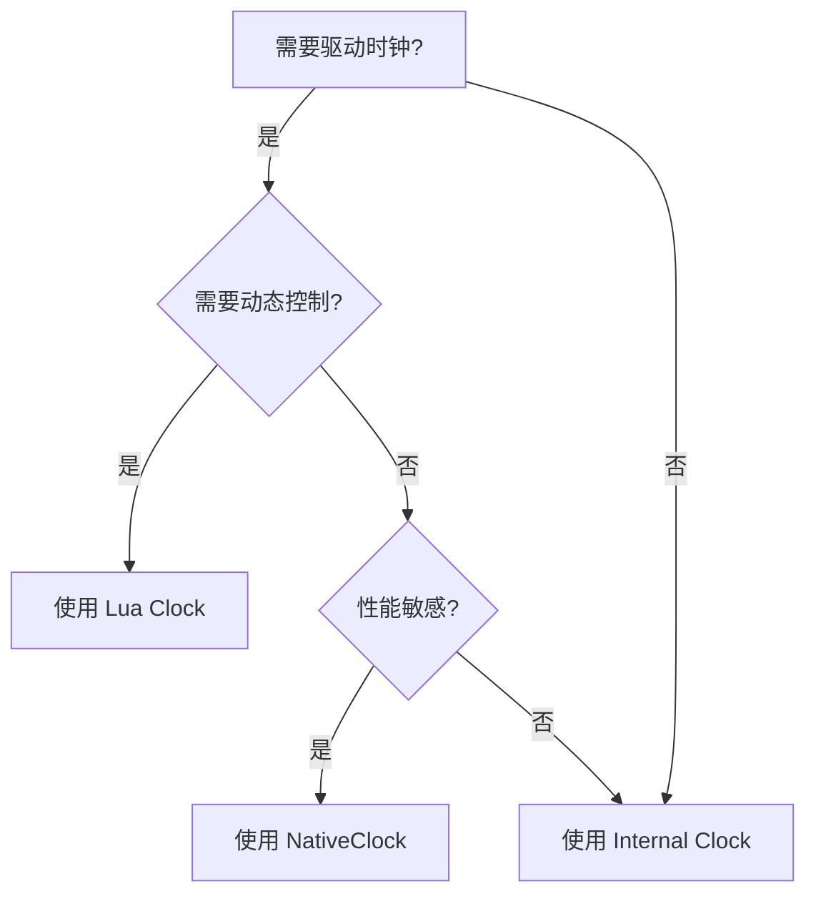

# 时钟驱动策略

在 Verilua 中，有多种方式来驱动时钟信号。本文将介绍三种主要的时钟驱动策略，并帮助你根据具体场景选择最合适的方式。

## 三种时钟驱动策略

| 策略 | 说明 | 适用场景 |
| --- | --- | --- |
| Internal Clock | RTL 中的 always 块生成时钟 | 大多数常规验证场景 |
| Lua Clock | Lua 协程驱动时钟 | 需要精确控制时钟的场景 |
| NativeClock | Rust 原生驱动时钟 | 高性能时钟驱动场景 |

## 1. Internal Clock（内部时钟）

这是 Verilua 的默认时钟驱动方式。时钟由 Testbench Generator 自动在 RTL 中生成一个 always 块来驱动。

### 工作原理

Verilua 的 Testbench Generator 会自动在生成的 testbench 中添加类似以下的 Verilog 代码：

```verilog
initial begin
    clock = 0;
end

always #10 clock = ~clock;  // 默认周期 20ns（半周期 10ns）
```

### 配置方式

默认情况下，Testbench Generator 会自动生成内部时钟。你可以在 xmake.lua 中通过 `cfg.tb_gen_flags` 配置时钟参数：

```lua
target("my_test", function()
    add_rules("verilua")
    
    -- 设置时钟周期为 10ns（默认为 20ns）
    add_values("cfg.tb_gen_flags", "--period", "10")
    
    -- 如果时钟信号名不是默认的 clock，需要指定
    add_values("cfg.tb_gen_flags", "--clock-signal", "clk")
end)
```

### 时钟信号自动识别

如果不指定 `--clock-signal`，Testbench Generator 会按以下优先级自动检测时钟信号（不区分大小写）：
1. `clock`
2. `clock_i`
3. `clk`
4. `clk_i`
5. `i_clk`

### 主要参数

| 参数 | 说明 | 默认值 |
| --- | --- | --- |
| `-p, --period` | 时钟周期（单位由 timescale 决定，通常为 ns） | 20 |
| `--clock-signal, --cs` | 时钟信号名称 | 自动检测 |

### 优点

- **简单易用**: 无需手动驱动时钟
- **性能最优**: 时钟在仿真器内部生成，无额外开销
- **稳定可靠**: 由仿真器原生支持

### 缺点

- **灵活性较低**: 无法在运行时动态调整时钟参数
- **功能受限**: 无法实现时钟门控、动态频率调整等高级功能

### 适用场景

- 大多数常规验证场景
- 不需要动态控制时钟的测试

## 2. Lua Clock（Lua 协程时钟）

当需要精确控制时钟时，可以禁用内部时钟，改用 Lua 协程来驱动时钟。

### 配置方式

首先需要禁用内部时钟：

```lua title="xmake.lua"
target("my_test", function()
    add_rules("verilua")
    -- 禁用内部时钟
    set_values("cfg.no_internal_clock", "1")
end)
```

然后在 Lua 代码中手动驱动时钟：

```lua title="main.lua"
local clock = dut.clock:chdl()

-- 时钟驱动任务
fork {
    function()
        while true do
            clock:set(1)
            await_time(5)  -- 高电平持续 5 个时间步（默认 timescale 1ns/1ps，即 5ns）
            clock:set(0)
            await_time(5)  -- 低电平持续 5 个时间步
        end
    end,

    -- 主测试任务
    function()
        -- 你的测试代码
        for i = 1, 100 do
            dut.clock:posedge()
        end
        sim.finish()
    end
}
```

### 优点

- **完全控制**: 可以实现任意时钟波形
- **动态调整**: 可以在运行时改变时钟频率
- **高级功能**: 支持时钟门控、相位调整等

### 缺点

- **性能开销**: 每个时钟周期都需要 Lua 和仿真器之间的上下文切换
- **代码复杂**: 需要手动编写时钟驱动逻辑

### 使用示例

#### 基本时钟驱动

```lua
local clock = dut.clock:chdl()

fork {
    function()
        while true do
            clock:set(1)
            await_time_ns(5)
            clock:set(0)
            await_time_ns(5)
        end
    end
}
```

#### 可变频率时钟

```lua
local clock = dut.clock:chdl()
local clock_period = 10 -- 初始周期 10ns

fork {
    function()
        while true do
            clock:set(1)
            await_time_ns(clock_period / 2)
            clock:set(0)
            await_time_ns(clock_period / 2)
        end
    end,

    function()
        -- 运行一段时间后改变频率
        dut.clock:posedge(100)
        clock_period = 20 -- 改为 20ns 周期
        
        dut.clock:posedge(100)
        sim.finish()
    end
}
```

### 适用场景

- 需要动态调整时钟频率的测试
- 需要实现时钟门控的场景
- 需要精确控制时钟相位的场景

## 3. NativeClock（原生时钟）

`NativeClock` 是专为高性能时钟驱动设计的解决方案。它在 Rust 原生代码中实现时钟切换，避免了每个时钟周期的 Lua 上下文切换开销。

### 配置方式

首先需要禁用内部时钟，并且对于 Verilator 需要启用 TIMING_MODE：

```lua title="xmake.lua"
target("my_test", function()
    add_rules("verilua")
    set_values("cfg.no_internal_clock", "1")
    
    -- Verilator 需要 TIMING_MODE
    add_defines("TIMING_MODE")
    add_verilator_flags("--timing")
end)
```

然后在 Lua 代码中使用 NativeClock：

```lua title="main.lua"
local NativeClock = require "verilua.utils.NativeClock"

fork {
    function()
        local clk = NativeClock(dut.clock:chdl())
        
        -- 启动 10ns 周期时钟
        clk:start(10, "ns")
        
        -- 运行测试
        for i = 1, 1000 do
            dut.clock:posedge()
        end
        
        clk:stop()
        clk:destroy()
        sim.finish()
    end
}
```

### 优点

- **高性能**: 相比 Lua 时钟有显著的性能提升
- **低延迟**: 时钟切换完全在原生代码中完成
- **易用性**: API 简洁，配置简单

### 缺点

- **灵活性较低**: 仅支持固定波形，不支持动态调整（需要 stop/restart）
- **依赖限制**: Verilator 需要 TIMING_MODE
- **仅限 HVL**: 不支持 HSE 和 WAL 模式

### API 简介

```lua
local NativeClock = require "verilua.utils.NativeClock"

-- 创建实例
local clk = NativeClock(dut.clock:chdl())

-- 启动时钟：周期、单位、可选配置
clk:start(10, "ns")                              -- 10ns 周期，50% 占空比
clk:start(10, "ns", { high = 3 })               -- 30% 占空比
clk:start(10, "ns", { start_high = false })    -- 从低电平开始

-- 控制
clk:stop()                -- 停止时钟
clk:restart(20, "ns")    -- 重启为新周期
clk:is_running()          -- 检查是否运行中

-- 清理
clk:destroy()
```

### 适用场景

- 需要高性能时钟驱动的大规模仿真
- 时钟参数相对固定的测试
- 性能敏感的回归测试

## 性能对比

三种时钟驱动策略的性能排序：

**Internal Clock** > **NativeClock** > **Lua Clock**

- **Internal Clock**: 性能最优，时钟在仿真器内部生成，无额外开销
- **NativeClock**: 性能次优，避免了 Lua 上下文切换开销
- **Lua Clock**: 性能最低，每个时钟周期都需要 Lua 和仿真器之间的上下文切换

:::tip
如果不需要动态控制时钟，优先使用 Internal Clock。如果需要禁用内部时钟并追求性能，使用 NativeClock。
:::

## 选择建议



| 场景 | 推荐策略 |
| --- | --- |
| 常规验证，时钟参数固定 | Internal Clock |
| 需要动态频率调整 | Lua Clock |
| 需要高性能，参数固定 | NativeClock |
| 时钟门控、相位控制 | Lua Clock |

## 相关文档

- [NativeClock API 参考](../reference/native_clock.mdx)
- [Testbench 生成器](../reference/testbench_generate.mdx)
- [xmake 参数说明](../reference/xmake_params.mdx)
- [多任务](../reference/multi_task.mdx)
