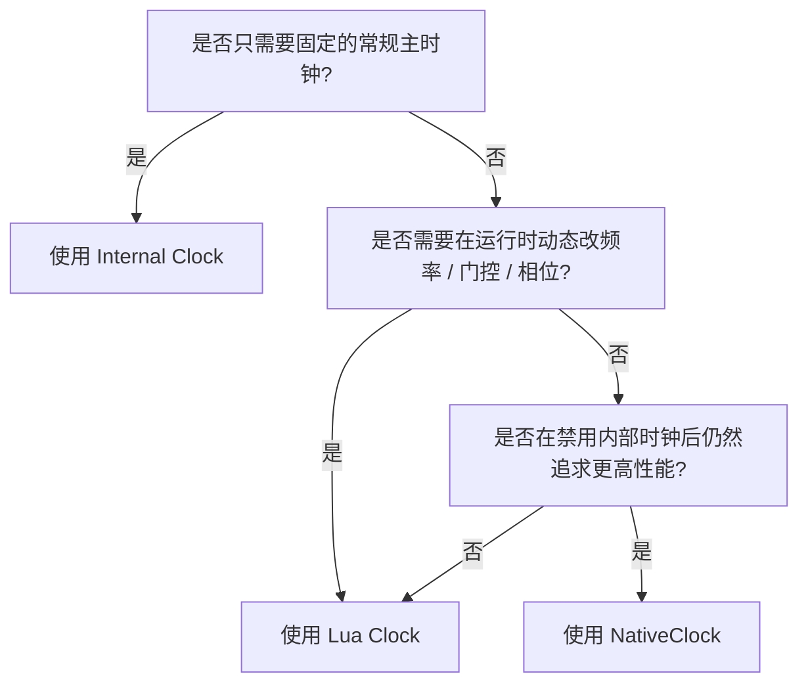

# 时钟驱动策略

在 Verilua 的 HVL 场景中，主时钟通常有三种驱动方式：

- `Internal Clock`：由 `testbench_gen` 在生成的 RTL testbench 中自动产生时钟
- `Lua Clock`：由 Lua 协程手动驱动时钟
- `NativeClock`：由 Rust 原生层驱动时钟

如果你的目标只是运行一个常规单时钟测试，优先使用 `Internal Clock`。只有在需要运行时动态控制时钟，或者需要完全接管时钟生成时，才建议切换到 `Lua Clock` 或 `NativeClock`。

## 快速对比

| 策略 | 时钟生成位置 | 运行时动态调频/门控 | 多时钟控制 | 性能 | 额外要求 |
| --- | --- | --- | --- | --- | --- |
| `Internal Clock` | 生成的 RTL testbench | 不支持 | 不适合 | 最优 | 无 |
| `Lua Clock` | Lua 协程 | 支持 | 支持 | 最低 | 需要 `verilua.no_internal_clock`；Verilator 下基于 `await_time*()` 时通常需要 `--timing` |
| `NativeClock` | Rust 原生层 | 有限支持（通过 `stop()` / `restart()`） | 支持 | 高于 Lua，低于 Internal | 需要 `verilua.no_internal_clock`；Verilator 下需要 `--timing`；仅支持 HVL |

## 选择建议


```mermaid
flowchart TD
    A[是否只需要固定的常规主时钟?] -->|是| B[使用 Internal Clock]
    A -->|否| C[是否需要在运行时动态改频率 / 门控 / 相位?]
    C -->|是| D[使用 Lua Clock]
    C -->|否| E[是否在禁用内部时钟后仍然追求更高性能?]
    E -->|是| F[使用 NativeClock]
    E -->|否| D
```

## 1. Internal Clock

在使用 `testbench_gen` 的 HVL 场景下，如果没有显式设置 `verilua.no_internal_clock`，Verilua 默认会在生成的 testbench 中自动添加一个时钟驱动逻辑。

### 工作原理

生成的 testbench 中会包含类似下面的 Verilog 代码：

```verilog
initial begin
    clock = 0;
end

always #10 clock = ~clock;  // 默认周期 20ns（半周期 10ns）
```

### 配置方式

你可以在 `xmake.lua` 中通过 `verilua.tb_gen_flags` 调整内部时钟的主时钟名和周期：

```lua title="xmake.lua"
target("my_test", function()
    add_rules("verilua")

    -- 设置时钟周期为 10ns（默认为 20ns）
    add_values("verilua.tb_gen_flags", "--period", "10")

    -- 如果主时钟信号名不是默认的 clock，需要显式指定
    add_values("verilua.tb_gen_flags", "--clock-signal", "clk")
end)
```

### 时钟信号自动识别

如果不指定 `--clock-signal`，`testbench_gen` 会按以下优先级自动检测主时钟信号名（不区分大小写）：

1. `clock`
2. `clock_i`
3. `clk`
4. `clk_i`
5. `i_clk`

如果设计里存在多个时钟，建议始终显式指定 `--clock-signal`，不要依赖自动识别。

### 主要参数

| 参数 | 说明 | 默认值 |
| --- | --- | --- |
| `-p, --period` | 时钟周期，单位由当前仿真 `timescale` 决定 | `20` |
| `--clock-signal, --cs` | 主时钟信号名称 | 自动检测 |

### 优点

- 配置最简单
- 性能最好
- 由仿真器 / 生成的 testbench 直接驱动，行为稳定

### 缺点

- 只能用于固定波形的主时钟
- 不能在运行时动态改频率、做门控或相位控制
- 不适合需要完全由用户代码管理多路时钟的场景

### 适用场景

- 单时钟设计
- 时钟参数固定
- 追求最高仿真性能

## 2. Lua Clock

当你需要完全接管时钟行为时，可以禁用内部时钟，改用 Lua 协程手动驱动。

### 配置方式

首先禁用内部时钟：

```lua title="xmake.lua"
target("my_test", function()
    add_rules("verilua")
    set_values("verilua.no_internal_clock", "1")

    -- 如果使用 Verilator，并且通过 await_time*() 推进时间，通常需要 --timing
    set_values("verilator.flags", "--timing")
end)
```

然后在 Lua 中手动驱动时钟：

```lua title="main.lua"
local clock = dut.clock:chdl()

fork {
    function()
        while true do
            clock:set(1)
            await_time_ns(5)
            clock:set(0)
            await_time_ns(5)
        end
    end,

    function()
        for i = 1, 100 do
            dut.clock:posedge()
        end
        sim.finish()
    end
}
```

:::note
`await_time(x)` 等待的是仿真原始时间步，不是固定的 `ns`。默认 `timescale` 为 `1ns/1ps` 时，原始步数通常对应 `1ps` 精度，因此除非你明确要按原始步数编程，否则更推荐使用 `await_time_ns()`、`await_time_ps()` 或 `await_time_unit()`。

你也可以通过 `cfg.time_precision` 和 `cfg.time_unit` 查看当前时间精度。
:::

### 优点

- 最灵活，可以实现任意时钟波形
- 可以在运行时调整频率、占空比、相位
- 适合多时钟、门控时钟、特殊波形

### 缺点

- 每个边沿都要经过 Lua 调度，性能开销最大
- 时钟逻辑需要自己维护，代码量更多

### 使用示例

#### 基本时钟驱动

```lua
local clock = dut.clock:chdl()

fork {
    function()
        while true do
            clock:set(1)
            await_time_ns(5)
            clock:set(0)
            await_time_ns(5)
        end
    end
}
```

#### 可变频率时钟

```lua
local clock = dut.clock:chdl()
local clock_period = 10 -- 初始周期 10ns

fork {
    function()
        while true do
            clock:set(1)
            await_time_ns(clock_period / 2)
            clock:set(0)
            await_time_ns(clock_period / 2)
        end
    end,

    function()
        dut.clock:posedge(100)
        clock_period = 20 -- 改为 20ns 周期

        dut.clock:posedge(100)
        sim.finish()
    end
}
```

### 适用场景

- 需要动态调整时钟频率的测试
- 需要时钟门控、非 50% 占空比或相位控制
- 需要手动管理多路时钟

## 3. NativeClock

`NativeClock` 适合“禁用内部时钟后，仍希望降低 Lua 时钟开销”的场景。它在 Rust 原生层完成时钟切换，避免了每个边沿都回到 Lua。

### 使用前提

- 需要先禁用内部时钟：`set_values("verilua.no_internal_clock", "1")`
- 使用 Verilator 时需要启用 `--timing`
- 仅支持 HVL，不支持 HSE 和 WAL
- 同一时刻同一信号只能由一个 `NativeClock` 驱动

### 配置方式

```lua title="xmake.lua"
target("my_test", function()
    add_rules("verilua")
    set_values("verilua.no_internal_clock", "1")

    -- Verilator 下 NativeClock 需要 --timing
    set_values("verilator.flags", "--timing")
end)
```

```lua title="main.lua"
local NativeClock = require "verilua.utils.NativeClock"

fork {
    function()
        local clk = NativeClock(dut.clock:chdl())

        clk:start(10, "ns")

        for i = 1, 1000 do
            dut.clock:posedge()
        end

        clk:stop()
        clk:destroy()
        sim.finish()
    end
}
```

### 优点

- 明显降低纯时钟驱动场景中的 Lua 调度开销
- API 简单，适合固定周期、固定占空比时钟
- 在多时钟测试中也可使用多个 `NativeClock`，前提是它们驱动不同信号

### 缺点

- 灵活性不如 Lua Clock；运行中改参数通常需要 `stop()` / `restart()`
- 不适合复杂门控或按周期实时改波形的场景
- 存在模式和 simulator 前提限制

### 常用 API

```lua
local NativeClock = require "verilua.utils.NativeClock"

local clk = NativeClock(dut.clock:chdl())

clk:start(10, "ns")
clk:start(10, "ns", { high = 3 })
clk:start(10, "ns", { start_high = false })

clk:stop()
clk:restart(20, "ns")
clk:is_running()
clk:destroy()
```

更完整的参数说明见 [原生时钟驱动（NativeClock）API 参考](../reference/native_clock.mdx)。

### 适用场景

- 已禁用内部时钟，但仍希望获得比 Lua Clock 更好的性能
- 时钟参数大多固定，偶尔才需要重启修改
- 性能敏感的回归测试

## 性能排序

通常情况下，三种策略的性能关系如下：

**Internal Clock** > **NativeClock** > **Lua Clock**

- `Internal Clock`：时钟完全在生成的 RTL testbench 中推进，开销最小
- `NativeClock`：避免每个边沿都回到 Lua，但仍不是 RTL 内部原生生成
- `Lua Clock`：每个边沿都要经过 Lua 调度，最灵活，也最慢

:::tip
如果你不需要运行时动态控制时钟，优先使用 `Internal Clock`。如果你已经禁用了内部时钟，并且时钟波形基本固定，优先考虑 `NativeClock`。
:::

## 常见踩坑

1. 使用 `Lua Clock` 或 `NativeClock` 时忘记设置 `verilua.no_internal_clock`
2. 在 Verilator 下使用 `await_time*()` 或 `NativeClock` 时忘记加 `set_values("verilator.flags", "--timing")`
3. 把 `await_time(5)` 误以为是 `5ns`，实际上它表示 5 个原始仿真时间步
4. 多个驱动同时驱动同一根时钟信号，例如内部时钟和 Lua 时钟同时存在
5. 多时钟设计里依赖 `--clock-signal` 自动识别，结果选错了主时钟

## 相关文档

- [原生时钟驱动（NativeClock）API 参考](../reference/native_clock.mdx)
- [Testbench 生成器](../reference/testbench_generate.mdx)
- [xmake 参数说明](../reference/xmake_params.mdx)
- [多任务](../reference/multi_task.mdx)
