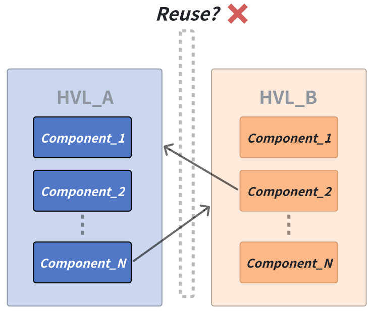
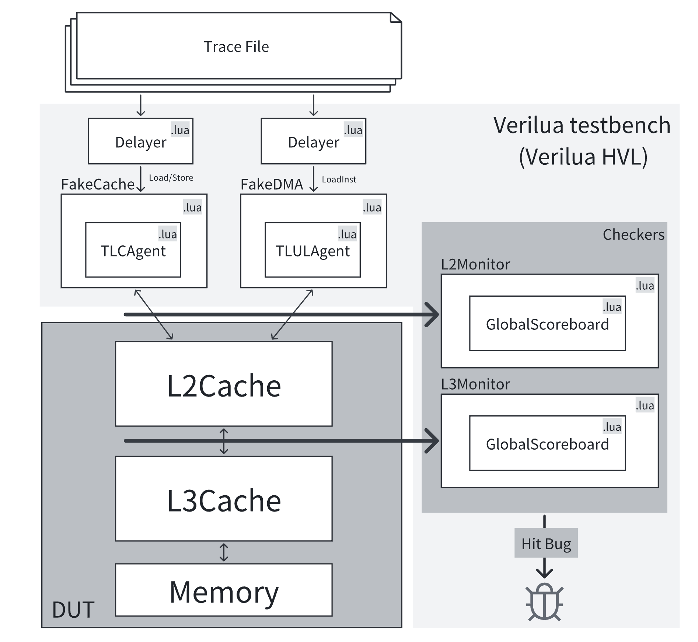
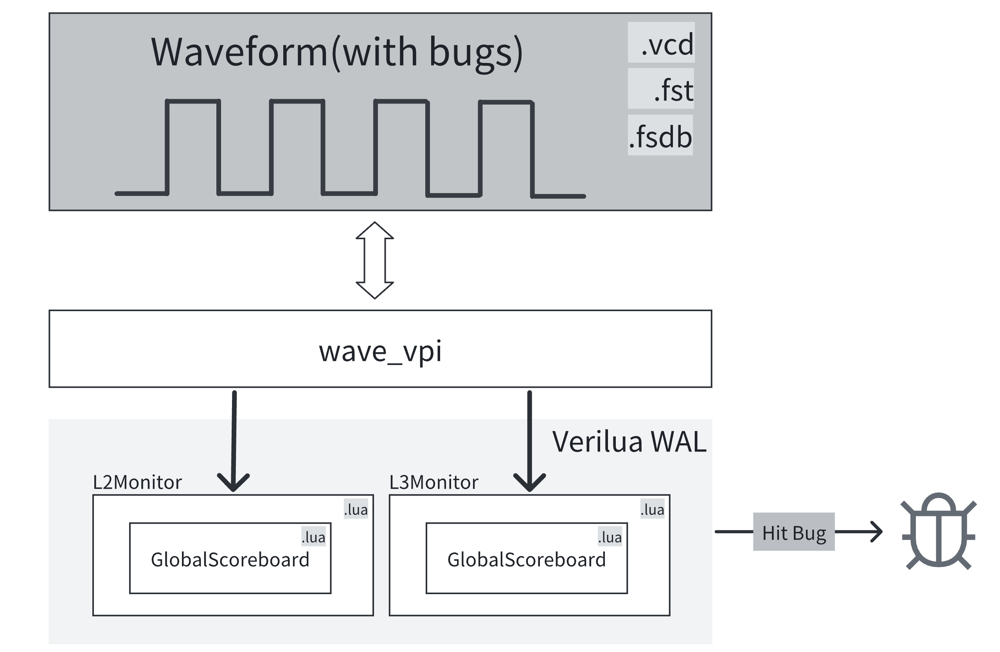

# Welcome to `Verilua` documentation!

Verilua 是一个基于中间件分层架构的硬件验证解耦仿真框架，统一了包括：Hardware Verification Language（`HVL`）、Hardware Script Engine（`HSE`）、Waveform Analysis Language（`WAL`）在内的多种验证场景，解决了验证生态碎片化的问题。
Verilua 的 HVL、HSE、WAL 能够覆盖硬件验证中的多个流程。
<figure markdown="span">
  { width="70%" }
  <figcaption>HVL、HSE、WAL 能够覆盖硬件验证中的多个流程</figcaption>
</figure>

!!! note "硬件验证生态碎片化问题"
    随着各种开源验证框架/语言的出现，使用各种开源的验证框架/语言开发与验证芯片逐渐成为主流，而现代高性能处理器的验证也越来越复杂化，完整的验证流程中不同层次不同模块的验证通常就会包括多个不同的验证环境，不同的验证环境会根据验证需求的不同采用不同的 HVL（Hardware Verification Language），例如对于 ST（System Test），此时对于仿真速度有更高的要求，因此会采用 HVL_A，对于UT（Unit Test）则对验证效率有更高的要求，UT 的验证环境需要能够快速迭代，因此就会可能会采用 HVL_B。不同 HVL 编写的验证组件在不同的验证环境下难以复用，这就导致了验证生态存在碎片化问题，因为这些不同 HVL 编写的验证组件就像孤立的岛屿，难以在多样化的验证场景中实现有效迁移与复用，最终导致整体的验证效率低下。
    <figure markdown="span">
      { width="50%" }
      <figcaption>验证组件的复用问题</figcaption>
    </figure>

## Hardware Verification Language（`HVL`）
硬件验证语言，专门用于硬件验证场景，能够控制验证平台的运行或者描述复杂的验证逻辑，我们熟悉的 SystemVerilog 就属于一种 HVL（当然也属于 HDL），类似地 [Cocotb](https://www.cocotb.org/) 框架允许将 Python 作为一种 HVL，而 [Verilator](https://veripool.org/guide/latest/) 能够允许用户将 C++ 作为一种 HVL。

在 Verilua 中，Lua 语言被选择用来作为 Verilua 的 HVL（Verilua 的名字由来：Verification + Lua），具体而言采用的是 [LuaJIT](https://luajit.org/) 这一 Lua 实现，因为 LuaJIT 是一个性能更高的 Lua 实现，并且支持 JIT 编译，这能够为 Verilua 提供更好的 HVL 性能。Verilua 在 LuaJIT 的基础上构造了一个 DSL（Domain Specific Language），以方便用户能够使用 Lua 语言来进行硬件验证业务代码的编写，从而能够使用 Lua 语言作为一种 HVL。

## Hardware Script Engine（`HSE`）
脚本引擎（Script Engine, SE）作为一种动态代码执行环境，在浏览器和游戏开发中得到了广泛应用，例如浏览器通过 JavaScript SE 扩展功能，游戏开发则常嵌入 Lua SE 以支持用户编写插件。Verilua 将这一概念扩展到了硬件仿真中，提出了 Hardware Script Engine（HSE）。例如在硬件仿真的过程中我们经常会有动态打印某些信号的 log 或者需要动态统计某些信号的性能事件的需求，传统的做法通常是修改 RTL 代码向其中临时插入相关业务代码（如 print 语句）来实现这些功能，但是事实上我们完全可以使用一个动态的 SE 来实现，也就是在 RTL 仿真的时候嵌入一个 Lua SE，并且在 SE 中可以通过 VPI 访问所有RTL 信号信息，并可以使用 Lua 来编写动态的代码以应对时刻变化的需求。

HSE 底层的接口基于 VPI（Verilog Procudural Interface），由于 VPI 的通用性（几乎所有的硬件仿真器都支持 VPI），因此 HSE 能够使得 Verilua 编写的验证组件在非 Verilua 的任何支持 VPI 的验证环境中使用。因此 HSE 是 Verilua 中实现跨环境验证组件复用的关键。得益于 Verilua 的解耦框架设计，HSE 能够复用 HVL 中编写的验证组件，也就是说如果用户在 HVL 场景下编写了一系列的验证组件（例如 Monitor、Scoreboard），那么在 HSE 中是可以直接拿过来复用的，这使得 Verilua 编写的验证组件具有更好的复用性。

## Waveform Analysis Language（`WAL`）
WAL 的概念最早于 2022 年由 Lucas Klemmer 等人的一篇[论文](https://ics.jku.at/files/2022ASPDAC_WAL.pdf)提出（[github 仓库](https://github.com/ics-jku/wal)，后续标记为 `lisp-wal`），其基本思想是利用编程语言自动化波形分析，不同于 lisp-wal 使用 lisp 语言实现了 WAL，Verilua 采用了 Lua 语言实现了 WAL，并且由于底层实现的不同，Verilua 的性能比 lisp-wal 更好，且支持的波形格式更多（包括 VCD、FST、FSDB，而 lisp-wal 只支持 VCD、FST），因此更加适合较大规模的波形分析场景。

由于 WAL 属于 Verilua 的其中一种使用场景，因此 WAL 场景下也能够复用 HVL、HSE 中使用的验证组件，这种复用性极大地提高了波形分析效率，用户可以通过复用来减少重复开发的成本。

## Verilua 架构概览
Verilua 的解耦框架中，分为 Frontend、Kernel、Backend 三个层次，其中 Frontend 表示的是用户的业务代码； Kernel 则包含了 Scheduler、Handles 等 DSL 的核心组件以及 Verilua 的运行时环境等；Backend 对于 HVL、HSE 表示的是具体的硬件仿真器，对于 WAL 这里指的则是 Verilua 开发的 `wave_vpi`。

HVL、HSE、WAL 基于同一个中间件（VPI-ML），用于连接 Kernel 和 Backend，VPI-ML 能够在各种硬件仿真器中支持，这是实现解耦与复用的关键，特别地对于 HSE，可以使用 `dummy_vpi`（后续将会介绍） 代替这一中间件来减少 HSE 的接入开销。

中间件（VPI-ML）和 Frontend、Kernel、Backend 的架构组成是 Verilua 的解耦框架设计的基础，这种架构提供了最大的可扩展性.

<figure markdown="span">
  { width="70%" }
  <figcaption>Verilua 架构</figcaption>
</figure>

!!! note "Verilua 的验证组件复用"
    Verilua 的解耦框架设计允许 HVL、HSE、WAL 的验证组件在这三种场景下的任意一种中复用，任意一种场景下编写的验证组件无需考虑复用性问题，Verilua 从框架层面上就支持复用。从下图可以看到所有相同颜色的组件都是同一份代码，它们在 HVL、HSE、WAL 三个场景下都能无修改复用。
    <figure markdown="span">
      { width="50%" }
      <figcaption>Verilua 的验证组件复用</figcaption>
    </figure>

## 应用案例
在本节中，我们将展示 Verilua 作为硬件验证语言（HVL）、硬件仿真引擎（HSE）和波形分析语言（WAL）的用例，展示其与传统仿真框架相比的独特特性。我们所有的案例将围绕[香山处理器](https://github.com/OpenXiangShan/XiangShan)南湖V3（`NHV3`）系列开源高性能处理器的缓存子系统的验证和调试过程展开。

### Verilua as an HVL
在 NHV3 中，我们使用 Verilua 构建了一个针对缓存子系统（包括 L2/L3 缓存）的验证平台，如下图所示。Verilua 作为一种硬件验证语言（HVL）的应用，涉及多个关键的验证组件，例如 FakeCache、FakeDMA、TLCAgent、TLULAgent、L2Monitor、L3Monitor 和 GlobalScoreboard，这些组件均使用 Lua 编写。其中，FakeCache 和 FakeDMA 组件通过 VPI 与待测设计（DUT）的信号进行交互。

<figure markdown="span">
  { width="70%" }
  <figcaption>Verilua as an HVL</figcaption>
</figure>

在该验证平台中，每个组件都具备相对独立的功能。例如，L2/L3 Monitor 负责从 L2/L3 缓存中读取总线信号并记录日志，以便后续分析。GlobalScoreboard 是一个关键的检查组件，用于确保缓存系统内的全局数据一致性，这对于维护缓存操作的完整性至关重要。

使用 Lua 编写这些组件的一个显著优势是，对业务逻辑的修改无需重新编译整个验证平台。这种能力使得平台能够快速迭代和开发，从而提高了整体效率。此外，Lua 高效且灵活的语法有助于创建适应性强的验证平台。与传统的 SystemVerilog 验证平台相比，Lua 的轻量级和动态特性使得验证环境更易于维护和扩展。

### Verilua as an HSE
在本示例中，我们将 Verilua 作为硬件仿真引擎（HSE）嵌入到现有的仿真框架中。在 NHV3 的顶层仿真中，[difftest](https://github.com/OpenXiangShan/difftest) 执行指令级比较以确保正确性。如果 L2/L3 缓存中存在错误，该错误会通过处理器流水线传播，并仅在 difftest 比较架构寄存器时被检测到。这使得验证工程师难以定位错误，需要追溯到缓存子系统，这一过程耗时且严重影响调试效率。

通过将 Verilua 嵌入到 difftest 仿真环境中，我们可以利用之前开发的组件（如 L2/L3Monitor 和 GlobalScoreboard），并通过 VPI 将它们连接到 L2/L3 缓存总线信号，如下图所示。这种设置使得 Monitor 组件能够记录总线行为，而 GlobalScoreboard 则实时检查数据正确性。如果发生错误，仿真会立即停止，并提供错误信息，从而帮助快速将问题定位到 L2/L3 缓存。

<figure markdown="span">
  { width="70%" }
  <figcaption>Verilua as an HSE</figcaption>
</figure>

在这种情况下，Verilua 的使用促进了现有验证组件的重用，而无需重写或插入调试代码片段。整个过程是非侵入式的，最大限度地减少了对原始 RTL 设计的干扰，并避免了因频繁修改 RTL 代码而引入新错误的风险，最终提高了验证过程的效率和准确性。

将 Verilua 作为 HSE 使用，使我们能够灵活地收集各种仿真信号信息。例如，一个简单的 Lua 脚本可以统计缓存命中率、未命中率、读写延迟等，并在仿真过程中打印这些信息。这种方法无需修改 RTL 来扩展仿真功能，因为所有功能都可以通过 Lua 脚本动态实现。

### Verilua as an WAL
在最后一个示例中，我们展示了 Verilua 作为波形分析语言（WAL）如何提高波形分析效率。假设验证工程师在使用其他验证平台时遇到了一个错误，但无法定位问题。他们发送给我们一个波形文件进行调试。通常情况下，我们需要从他们提供的有限信息入手，逐步排查问题，这一过程可能非常耗时，尤其是当问题出现在缓存子系统的 L3Cache 中时。

借助 Verilua，我们可以使用 wave_vpi 后端对波形文件进行仿真。在此仿真过程中，我们可以利用 L2/L3Monitor、GlobalScoreboard 以及前文示例中的其他组件（如下图所示）来帮助识别错误并收集总线信息。通过将这些组件集成到波形仿真场景中，我们能够高效地分析波形。Monitors 和 GlobalScoreboard 会在仿真过程中精确定位错误发生的位置，并告知我们错误的具体来源。这种方法避免了繁琐的波形检查，使得我们可以将 Verilua 作为 WAL 来分析波形并重用验证组件，从而显著提升分析效率，节省调试时间，并提高生产力。

<figure markdown="span">
  { width="70%" }
  <figcaption>Verilua as an WAL</figcaption>
</figure>

在这些案例中，Verilua 能够利用同一套基于 Lua 的验证组件来应对 HVL、HSE 和 WAL 的不同场景。这展示了 Verilua 强大的可重用性，并显著提升了验证过程的效率。
