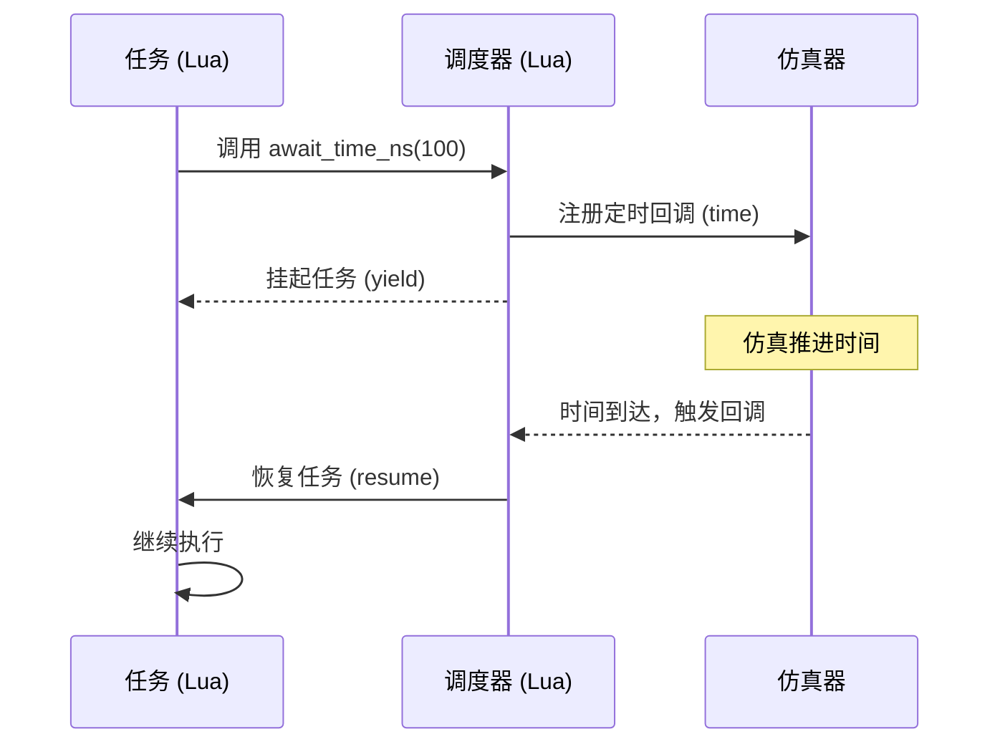

# 时间等待 API（await_time）

在 Verilua 的多任务系统中，任务可以通过 `await_time_*` 系列函数主动让出控制权，等待指定的仿真时间后继续执行。这是实现基于时间的延迟、超时控制、时钟无关等待等行为的基础。



## 函数列表

| 函数 | 时间单位 | 说明 |
| --- | --- | --- |
| `await_time(steps)` | 仿真步（step） | 等待指定的仿真步数（原始时间精度单位） |
| `await_time_fs(time)` | 飞秒（fs） | 等待指定的飞秒数 |
| `await_time_ps(time)` | 皮秒（ps） | 等待指定的皮秒数 |
| `await_time_ns(time)` | 纳秒（ns） | 等待指定的纳秒数 |
| `await_time_us(time)` | 微秒（µs） | 等待指定的微秒数 |
| `await_time_ms(time)` | 毫秒（ms） | 等待指定的毫秒数 |
| `await_time_s(time)` | 秒（s） | 等待指定的秒数 |
| `await_time_unit(time, unit)` | 任意单位 | 等待指定时间，可动态传入时间单位 |

## 基本语法

```lua
-- 等待 100 个仿真步（原始精度单位）
await_time(100)

-- 等待 50 纳秒
await_time_ns(50)

-- 等待 1 微秒
await_time_us(1)

-- 等待 10 皮秒
await_time_ps(10)

-- 使用动态单位
await_time_unit(2.5, "ns")
```

## 时间精度与单位

Verilua 的仿真时间精度由仿真器的 `timescale` 设置决定。默认情况下，Verilua 生成的 testbench 使用 `1ns/1ps` 的 timescale，即：

- **时间单位**：1 纳秒（ns）
- **时间精度**：1 皮秒（ps）

这意味着仿真器内部以 1ps 为最小步进单位。`await_time(steps)` 中的 `steps` 就是基于这个精度步进的。例如，`await_time(1000)` 表示等待 1000ps = 1ns。

您可以通过全局配置变量 `cfg` 查看当前的精度信息：

```lua
print(cfg.time_precision)  -- 输出 -12（表示 10^-12 秒 = 1ps）
print(cfg.time_unit)       -- 输出 "ps"（时间精度单位）
```

## 使用场景

### 1. 延迟等待（不依赖时钟）

```lua
fork {
    function()
        print("Start")
        await_time_ns(100)   -- 等待 100 纳秒
        print("100 ns later")
        await_time_us(1)     -- 等待 1 微秒
        print("1 us later")
    end
}
```

### 2. 时钟门控或自定义时钟生成

当[禁用内部时钟](../how-to-guides/clock_driving.mdx#2-lua-clock)后（在 `xmake.lua` 中设置 `set_values("verilua.no_internal_clock", "1")`），可以用 `await_time_*` 手动生成时钟：

```lua
fork {
    clock_gen = function()
        local clk = dut.clock:chdl()
        while true do
            clk:set(1)
            await_time_ns(5)
            clk:set(0)
            await_time_ns(5)
        end
    end
}
```

### 3. 超时检测

```lua
local ready = dut.ready:chdl()
local timeout = false

fork {
    function()
        await_time_us(10)   -- 等待 10 微秒
        timeout = true
    end,

    function()
        while not ready:is(1) and not timeout do
            await_time_ns(100)
        end
        assert(not timeout, "Ready signal timeout!")
    end
}
```

### 4. 等待异步事件后继续

```lua
fork {
    function()
        -- 触发某个操作
        dut.start:set(1)
        await_time_ns(500)   -- 等待 500 纳秒让 DUT 完成处理
        local result = dut.result:get()
        print("Result:", result)
    end
}
```

## 注意事项

### 与 `clock:posedge()` 的区别

- `clock:posedge()` 等待的是信号的**上升沿**，时间取决于时钟周期，通常用于同步逻辑。
- `await_time_*()` 等待的是**绝对时间**，与时钟信号无关，适合超时、延迟等场景。

两者可以混合使用：

```lua
fork {
    function()
        dut.clock:posedge(5)        -- 等待 5 个时钟上升沿
        await_time_ns(100)          -- 再等待 100 纳秒
        dut.clock:posedge()         -- 再等待一个时钟沿
    end
}
```

### 在 HSE 模式下的限制

当 `cfg.is_hse = true` 时（硬件脚本引擎模式），调度器会切换为非时间驱动的 step 模式。此时 `await_time_*` 的行为与 normal 模式**截然不同**，且取决于具体的调度器子模式（`cfg.mode`）。

#### `step` 模式（`cfg.mode = "step"`）

:::warning[单位变体在 step 模式下会忽略时间参数]
`await_time_ns`、`await_time_us`、`await_time_ms`、`await_time_fs`、`await_time_ps`、`await_time_s`、`await_time_unit` 在 step 模式下全部退化为**单次 yield**，时间参数被完全丢弃，不产生任何时间等待效果。
:::

**唯一有效的时间等待函数是 `await_time(time)`**，其行为为：

```lua
-- 实际执行逻辑（scheduler 内部）
local t = math.ceil(time / cfg.period)  -- cfg.period 默认 10，单位由 cfg.unit 决定（默认 "ns"）
for _ = 1, t do
    coro_yield(NOOP)   -- 每次 yield 对应一个时钟步
end
```

注意：step 模式下 `await_time(time)` 的 `time` 参数与 normal 模式的**语义不同**：

| 模式 | `await_time(time)` 的参数语义 |
| --- | --- |
| normal | 原始精度步数（如 1ns/1ps timescale 下单位为 ps） |
| step | 除以 `cfg.period` 后向上取整，得到等待的时钟步数（`time` 的单位应与 `cfg.unit` 一致） |

在 step 模式下，**请仅使用 `await_time(time)`**，避免使用带单位的变体。

#### `edge_step` 模式（`cfg.mode = "edge_step"`）

:::danger[所有 `await_time_*` 调用均会崩溃]
在 `edge_step` 模式下，`await_time`、`await_time_ns` 等所有时间等待函数被替换为直接触发断言错误：

```
Unsupported yield type in edge_step mode: await_time_ns
```

在此模式下不应调用任何 `await_time_*` 函数，调用会导致任务立即崩溃。请改用 `await_posedge_hdl` 或 `await_negedge_hdl`。
:::

### Verilator 的 `--timing` 要求

如果在 Verilator 中使用 `await_time_*`（尤其是 `await_time_ns` 等基于真实时间的函数），必须在编译时添加 `--timing` 选项，否则时间推进行为不正确。

在 `xmake.lua` 中设置：

```lua
add_values("verilator.flags", "--timing")
```

### 时间单位转换

`await_time_unit(time, unit)` 允许动态指定单位，支持的单位有：

- `"fs"` – 飞秒
- `"ps"` – 皮秒
- `"ns"` – 纳秒
- `"us"` – 微秒
- `"ms"` – 毫秒
- `"s"` – 秒

传入不在上述列表中的字符串（如 `"ms2"`）会触发断言错误：`Unknown time unit: ms2`。

示例：

```lua
local unit = "us"
await_time_unit(5, unit)   -- 等待 5 微秒
```

### 精度限制

`await_time_*` 内部使用四舍五入（round-half-up）将时间值转换为整数步数：

```
steps = floor(time × scale + 0.5)
```

当 `steps` 舍入结果为 0 时，会触发断言错误。以 1ps 精度（scale = 1）为例：
- `await_time_ps(0.5)` → `floor(0.5 × 1 + 0.5) = floor(1.0) = 1`，**不会**报错
- `await_time_ps(0.4)` → `floor(0.4 × 1 + 0.5) = floor(0.9) = 0`，**触发断言**

一般规律：当 `time × scale < 0.5` 时触发错误，即时间值严格小于半个精度单位时才会报错。请确保等待时间的舍入结果至少为 1 步。

## 相关文档

- [多任务系统](./multi_task.mdx) – 了解 `fork` 和任务调度机制
- [时钟驱动策略](../how-to-guides/clock_driving.mdx) – 对比时钟等待与时间等待
- [仿真器控制](./simulator_control.mdx) – 获取当前仿真时间 `sim.get_sim_time()`
