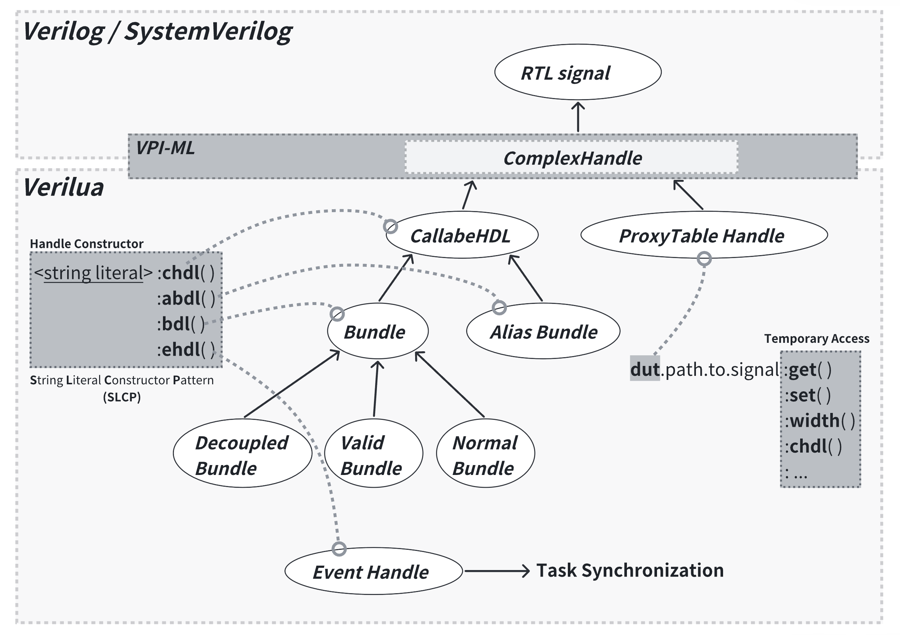

# 数据结构

在 `Verilua` 中，硬件信号通常被建模为 `Handle`，这也是 `Verilua` 中数据结构的主要命名方式。`Handle` 有多种类型：

1. CallableHDL(`chdl`)

    与信号进行操作的一个底层数据结构，提供了信号赋值和读取等接口，其中还包括了各种硬件信号相关的 Meta 信息，例如 width、hierarchy path。

2. Bundle(`bdl`)

    一种将多个信号封装在一起的数据结构，参考了 `Chisel` 的概念，因此支持 Decoupled 和 Valid 等子类型，能够统一管理多个 `chdl`。 

3. AliasBundle(`abdl`)

    一种特殊的 `bdl`，允许用户为信号组中的部分信号提供**别名**，从而提高代码可读性，同时仍支持对底层 `chdl` 的直接访问。

4. ProxyTableHandle(`dut`)

    通过全局 ProxyTable 智能解析路径（hierarchy path），支持与 `chdl` 几乎相同的信号操作接口，用户可直接访问信号，无需显式构造 `chdl` 或 `bdl`，简化访问复杂性，提升代码灵活性和可维护性。但是这种访问方式的设计之初主要是为了快速的临时访问信号，因此性能是不如 `chdl` 的。

5. EventHandle(`ehdl`)

    用于任务同步与通信，通过事件机制实现任务间的协调，用户可创建不同 `ehdl` 来同步任务执行顺序。需要注意的是，Event Handle 并非用于直接操作信号，而是用于管理任务之间的同步与通信，确保任务按预期顺序执行。

<figure markdown="span">
  { width="100%" }
  <figcaption>Verilua data structure</figcaption>
</figure>

## CallableHDL

### 创建 CallableHDL
#### 使用 dut 创建（推荐）
使用 `dut` 来创建 `chdl` 需要完整的使用 `dut` 表示出一个信号的 hierarchy path（这里的 `dut` 表示的是 Testbench 的模块名称，默认是 `tb_top`），例如：
```lua 
local signal = dut.path.to.signal:chdl()
```
通常对于一些 DUT 的**顶层信号**，可以使用 `dut.xxx` 表示，例如：
```lua 
local signal = dut.clock:chdl()
local signal2 = dut.reset:chdl()
```
对于 DUT 的内部信号，可以使用 `dut.u_<top_module_name>.<internal_signal_name>` 表示，具体原因可以查看[此处的说明](../getting-started/simple_hvl_example.md#about-dut)，代码例子如下： 
```lua 
local signal = dut.u_Design.value:chdl()
```

<a id="dut-flex_create_chdl"></a>
!!! tip "基于 `dut` 灵活创建 `chdl`"
    Lua 中，可以使用 string 来灵活访问某个 table 的子变量，例如：
    ```lua hl_lines="5 6 13 15"
    local t = {a0 = 1, a1 = 2, b0 = 3, b1 = 4}
    local a = t.a0
    local b = t.b0

    local aa = t["a0"]
    local bb = t["b0"]

    assert(a == aa)
    assert(b == bb)

    for i = 0, 1 do
        if i == 0 then
            assert(t["a" .. i] == t.a0)
        else
            assert(t["a" .. i] == t.a1)
        end
    end
    ```

    可以看到利用字符串拼接等方法访问一些有规律的子变量，这提供了更灵活的方式来访问子变量。
    
    而 `dut` 本质上也是一个 table，因此也可以使用 string 来访问 `dut` 的子变量，例如：
    ```lua
    local signals = {}
    for i = 1, 5 do
        table.insert(signals, dut.path.to["some_module_" .. i].value:chdl())
    end
    ```
    上面这个例子中我们使用 for 循环批量获得了 5 个 `chdl` 对象，这些对象分别对应 dut 中 some_module_1 到 some_module_5 这五个有规律的模块的 value 字段，并将其放入了一个 table 中。同样地，对于信号名也可以这么操作：
    ```lua
    local signals = {}
    for i = 1, 5 do
        table.insert(signals, dut.path.to["some_value_" .. i]:chdl()) 
    end
    ```

#### 使用 class 创建
本质上 `CallableHDL` 是一个 class，因此可以使用类似 `class` 的方式创建，例如：
```lua  
local CallableHDL = require "LuaCallableHDL"

local chdl = CallableHDL("name of the chdl", "tb_top.clock")

-- equivalent to

local chdl = dut.clock:chdl()
```
`CallableHDL` 接收两个参数，第一个是 `chdl` 的名称，第二个则是信号的完整 hierarchy path。

#### 使用 string literal 创建（推荐）
Lua 的允许重载 string 的 `metatable`，Verilua 基于这个机制实现了一种简化的方式来创建 `chdl`, 例如：
```lua 
local chdl = ("tb_top.clock"):chdl()
```
<a id="slcp-explain"></a>
这种方式在 Verilua 中被称为 **S**tring **L**iteral **C**onstructor **P**attern（SLCP），使用 SLCP 的好处在于可以不用像 `class` 构建那样提前使用 `#!lua require` 将 `LuaCallableHDL` 加载代码中，而是在使用时根据后缀的方法名（`:chdl()`）来直接创建 `chdl`。 除了 `chdl` 之外，其他的数据结构同样也支持使用 SLCP 的方式来创建。


### CallableHDL 接口
`CallableHDL` 支持多种信号操作接口，且相关接口函数的功能会与具体信号的位宽有关，因此在使用时需要注意一些细节。

Verilua 中根据信号的位宽不同，隐式地将 `chdl` 分为了三种类型：

1. Single：位宽 <= 32 bit 的信号
2. Double：位宽 > 32 bit 且 <= 64 bit 的信号
3. Multi：位宽 > 64 bit 的信号

!!! warning "在后续的 API 介绍的内容中，如果没有特别写出针对这三种情况的说明，那么默认情况下相关 API 的行为都是一致的"

!!! note "之所以会有区分是为了尽可能针位宽实施更多性能上的优化"

!!! note "`beat` 的概念"
    硬件信号的位宽是没有限制的，但是在 Lua 中普通的 number 类型能够保存 32 bit 的数值，因此 Verilua 以 32 bit 为单位来表示一部分的信号的值，这个单位称为 `beat`。例如：1 ～ 32 bit 的信号可以用 1 个 beat 来表示，33 ～ 64 bit 的信号可以用 2 个 beat 来表示，以此类推。beat 的概念在后续的 API 介绍中会经常遇到。

    可以使用 `#!lua <chdl>.beat_num` 来获得 beat 数。

#### 信号读取

1. `#!lua <chdl>:get()`

    === "Single"
        返回一个 Lua 的 number 类型的数值，表示当前的信号值。
    === "Double"
        `#!lua <chdl>:get(force_multi_beat)`
        
        - 如果 `force_multi_beat` 为 `true`，那么返回的是一个类型为 `uint32_t[]` 的 LuaJIT `cdata`，这个 `cdata` 的大小为 2，可以使用 `[1]` 访问第一个元素，`[2]` 访问第二个元素，由于 `cdata` 不是 Lua 的 `table` 因此实际上 `[0]` 也是可以访问的，但是这里 Verilua 会将 `[0]` 赋值为 beat 的大小，也就是这里的 2。

            !!! note "这里的 `cdata` 的 index 从 1 开始，这与 Lua 的 `table` 的 index 是一样的"

        - 如果 `force_multi_beat` 为 `false`，那么返回的是 `uint64_t` 类型的数值，由于 Double 类型的 `chdl` 的位宽为 32 ～ 64 bit，因此可以完整表达当前的数值。
    === "Multi"
        返回的是一个类型为 `uint32_t[]` 的 LuaJIT `cdata`，这个 `cdata` 的大小为当前信号的 beat 数，可以使用 `[1]` 访问第一个元素，`[2]` 访问第二个元素，以此类推， `[0]` 也是可以访问的，但是这里 Verilua 会将 `[0]` 赋值为 beat 的大小，例如对于 128 bit 的信号，`[0]` 会被赋值为 4。

2. `#!lua <chdl>:get64()`

    === "Single"
        返回一个 Lua 的 number 类型的数值，表示当前的信号值。
    === "Double / Multi"
        返回 `uint64_t` 类型的数值，由于 Double 类型的 `chdl` 的位宽为 32 ～ 64 bit，因此可以完整表达当前的数值，但是对于 Multi 类型的 `chdl`，此时 beat 大于 2，因此返回的 `uint64_t` 类型的数值不能完整表示当前的信号值，只会返回低 64 bit 的值。

3. `#!lua <chdl>:get_bitvec()`

    返回一个 `BitVec`，关于 `BitVec` 可以查看 [BitVec](./bitvec.md) 的文档。

4. `#!lua <chdl>:get_str(fmt)`
    <a id="chdl-get_str"></a>

    获得当前信号的数值，并以 String 的类型返回，接受一个 `fmt` 参数，用于指定返回的字符串的格式，可以是 `HexStr`、`BinStr`、`DecStr`。

    ```lua
    local signal = dut.value:chdl()

    local value = signal:get()
    assert(value == 0x123)

    local value_hex_str = signal:get_str(HexStr) 
    assert(value_hex_str == "123")

    local value_bin_str = signal:get_str(BinStr) 
    assert(value_bin_str == "100100011")

    local value_dec_str = signal:get_str(DecStr) 
    assert(value_dec_str == "291")
    ```

    !!! warning "这里的 `HexStr`、`BinStr`、`DecStr` 是 Verilua 预定义的全局变量，可以直接使用"

5. `#!lua <chdl>:get_hex_str()`
    <a id="chdl-get_hex_str"></a>

    获得当前信号的数值，并以 Hex String 的类型返回。

    ```lua
    local signal = dut.value:chdl()

    local value = signal:get()
    assert(value == 0x123)
    
    local value_hex_str = signal:get_hex_str()
    assert(value_hex_str == "123")
    ```

6. `#!lua <chdl>:get_dec_str()` 
    
    类似 `get_hex_str`，但是返回的是 Decimal String 类型的字符串。

7. `#!lua <chdl>:get_bin_str()`

    类似 `get_hex_str`，但是返回的是 Binary String 类型的字符串。


#### 信号赋值

1. `#!lua <chdl>:set(value)`

    === "Single"
        将 `value` 赋值给当前信号。

        ```lua
        local signal = dut.value:chdl()
        local value = 0x123
        signal:set(value)
        ```
    === "Double / Multi"
        `#!lua <chdl>:set(value, force_single_beat)`

        - 如果 `force_single_beat` 为 `nil`（也就是不传入这个参数），那么此时的 `value` 必须是一个 Lua number 类型的 table，并且这个 table 的大小需要和信号的 beat 数相同，否则会报错。这个 table 的数值以 `<LSB> ~ <MSB>` 的顺序排列。
            ```lua
            local signal = dut.value:chdl()
            local value = {0x123, 0x456}
            signal:set(value)
            ```

        - 如果 `force_single_beat` 为 `true`，那么此时的 `value` 可以是一个 Lua number 类型的数值，此时只能赋值信号的低 32 bit，如果 `value` 是一个 `uint64_t` 的 `cdata`，那么此时就能赋值信号的低 64 bit（对于 Double 类型的 `chdl` 也就是能覆盖整个信号的位宽），且高于 64 bit 的位置将会被赋值为 0。
            ```lua
            local signal = dut.value:chdl()

            local value = 0x123
            signal:set(value, true)

            local value64 = 0x1234567890ABCDEFULL
            signal:set(value64, true)
            ```

            !!! note "LuaJIT 中对一串数字添加上 `ULL` 的后缀就可以表示一个 `uint64_t` 类型的 `cdata`"

2. `#!lua <chdl>:set_unsafe(value)`

    和 `set` 类似，但是这个方法不会检查 `value` 的正确性，减少了一些 `assert` 检查语句的开销，性能会比 `set` 更好一些。

3. `#!lua <chdl>:set_cached(value)`

    === "Single"
        
        和 `set` 一样都用于赋值信号，但是在赋值的时候会将当前的信号值加入到缓存中，如果下次赋值的时候发现当前的信号值没有变化，那么就不会赋值，这样可以减少一些不必要的信号赋值。

    === "Double / Multi"
    
        暂不支持 Cached 赋值方式。

4. `#!lua <chdl>:set_str(str)`
    <a id="chdl-set_str"></a>

    一个通用的字符串赋值方式，可以接收一个 Lua string 类型的字符串，具体的字符串类型由 `str` 的前两位来区分，例如：

    ```lua
    local signal = dut.value:chdl()

    -- set hex string
    signal:set_str("0x123")

    -- set binary string
    signal:set_str("0b01011")

    -- set decimal string
    signal:set_str("123")
    ```

    `0x` 表示为 Hex String，`0b` 表示为 Binary String，其他的字符串则表示为 Decimal String。

5. `#!lua <chdl>:set_hex_str(str)`
    <a id="chdl-set_hex_str"></a>

    使用 Hex String 赋值，`str` 是一个 Lua string 类型的字符串。

    ```lua
    local signal = dut.value:chdl()

    signal:set_hex_str("123")

    clock:posedge()

    signal:expect(0x123)
    ```

6. `#!lua <chdl>:set_bin_str(value)`

    使用 Binary String 赋值，`value` 是一个 Lua string 类型的字符串。

    ```lua
    local signal = dut.value:chdl()

    signal:set_bin_str("1010")

    clock:posedge()

    signal:expect(0xA)
    ```

7. `#!lua <chdl>:set_dec_str(value)`

    使用 Decimal String 赋值，`value` 是一个 Lua string 类型的字符串。

    ```lua
    local signal = dut.value:chdl()

    signal:set_dec_str("12")

    clock:posedge()

    signal:expect(12)
    ```

8. `#!lua <chdl>:set_shuffled()`

    对当前信号进行**随机赋值**，这在验证中很常用。

9. `#!lua <chdl>:set_bitfield(s, e, v)`

    设置信号的值 `v`，并且只在 `s` 到 `e` 之间的位宽上赋值。`v` 可以是 Lua number 类型的数值，也可以是一个 `uint64_t` 类型的 `cdata`。
    
    ```lua
    local signal = dut.value:chdl()

    local value = 0x123
    signal:set_bitfield(0, 7, value)
    ```

10. `#!lua <chdl>:set_bitfield_hex_str(s, e, hex_str)`

    设置信号的值，并且只在 `s` 到 `e` 之间的位宽上赋值。`hex_str` 是一个 Hex String 类型的字符串.

    ```lua
    local signal = dut.value:chdl()

    local value = "123"
    signal:set_bitfield_hex_str(0, 7, value)
    ```

11. `#!lua <chdl>:set_force(value)`

    强制赋值（与 `set_release` 配合使用），与 SystemVerilog 中的 `force` 关键字相同。除了 `force` 这个属性上的区别之外，其他和 `set` 一样。

    ```lua
    local signal = dut.value:chdl()
    local value = 0x123
    signal:set_force(value)

    -- ...

    signal:set_release()
    ```

12. `#!lua <chdl>:set_release()`

    释放赋值（与 `set_force` 配合使用），与 SystemVerilog 中的 `release` 关键字相同。对于使用了 `set_force` 的信号，需要使用 `set_release` 来释放赋值，否则会导致信号的值不会更新。

13. `#!lua <chdl>:set_imm(value)`

    立即赋值版本的 `set`，除了立即赋值的属性之外，其他和 `set` 一样。

    <a id="set_and_set_imm"></a>
    !!! note "立即赋值和普通赋值的区别"
        `set` 方法进行赋值会在下一个时钟边沿到来后才会赋值（更接近 RTL 代码的行为，类似 Verilog 中的非阻塞赋值），而立即赋值则会立即赋值，且立即生效。
        ```lua
        local clock = dut.clock:chdl()
        local signal = dut.value:chdl() -- assume that the initial value is 0x00

        signal:set(0x123)
        assert(signal:get() == 0x00)

        clock:posedge()
        assert(signal:get() == 0x123) -- available right after the clock edge


        signal:set_imm(0x100)
        assert(signal:get() == 0x100) -- available right now

        clock:posedge()
        assert(signal:get() == 0x100)

        ```

14. `#!lua <chdl>:set_imm_unsafe(value)`

    立即赋值版本的 `set_unsafe`，除了立即赋值的属性之外，其他和 `set_unsafe` 一样。

15. `#!lua <chdl>:set_imm_cached(value)`

    立即赋值版本的 `set_cached`，除了立即赋值的属性之外，其他和 `set_cached` 一样。

16. `#!lua <chdl>:set_imm_str(value)`

    立即赋值版本的 `set_str`，除了立即赋值的属性之外，其他和 `set_str` 一样。

17. `#!lua <chdl>:set_imm_hex_str(value)`

    立即赋值版本的 `set_hex_str`，除了立即赋值的属性之外，其他和 `set_hex_str` 一样。

18. `#!lua <chdl>:set_imm_bin_str(value)`

    立即赋值版本的 `set_bin_str`，除了立即赋值的属性之外，其他和 `set_bin_str` 一样。

19. `#!lua <chdl>:set_imm_dec_str(value)`

    立即赋值版本的 `set_dec_str`，除了立即赋值的属性之外，其他和 `set_dec_str` 一样。

20. `#!lua <chdl>:set_imm_shuffled()`

    立即赋值版本的 `set_shuffled`，除了立即赋值的属性之外，其他和 `set_shuffled` 一样。

21. `#!lua <chdl>:set_imm_bitfield(s, e, v)`

    立即赋值版本的 `set_bitfield`，除了立即赋值的属性之外，其他和 `set_bitfield` 一样。

22. `#!lua <chdl>:set_imm_bitfield_hex_str(s, e, hex_str)`

    立即赋值版本的 `set_bitfield_hex_str`，除了立即赋值的属性之外，其他和 `set_bitfield_hex_str` 一样。

23. `#!lua <chdl>:set_imm_force(value)`

    立即赋值版本的 `set_force`，除了立即赋值的属性之外，其他和 `set_force` 一样。

24. `#!lua <chdl>:set_imm_release()`

    立即赋值版本的 `set_release`，除了立即赋值的属性之外，其他和 `set_release` 一样。


#### debug 相关

1. `#!lua <chdl>:dump()`

    <a id="chdl-dump"></a>

    用于将信号的值（主要是以 Hex String 的形式）输出到控制台，可以用于查看信号的值，打印的内容如下所示：

    ```shell title="Terminal"
    [tb_top.value] => 0x01
    ```

2. `#!lua <chdl>:dump_str()`
    <a id="chdl-dump_str"></a>

    会将原本`#!lua <chdl>:dump()` 的输出的内容作为一个返回值进行返回，因此 `#!lua <chdl>:dump()` 也等价于 `#!lua print(<chdl>:dump_str())`。

3. `#!lua <chdl>:get_width()`

    获得信号的位宽，也可以直接访问`#!lua <chdl>.width` 来获得。 

4. `#!lua <chdl>:__len()`

    `chdl` 重载了 Lua 的 metatable 的 `__len` 方法，可以直接使用 `#!lua #<chdl>` 来获得信号的位宽。下面的三种方式来获得信号位宽是等价的：

    ```lua
    local signal = dut.value:chdl()
    assert(#signal == 32)
    assert(signal:get_width() == 32)
    assert(signal.width == 32)
    ```

#### 验证相关

1. `#!lua <chdl>:expect(value)`

    用于断言信号的值，在验证中很常用，如果信号的值与期望值相等则什么也不会发生，如果不相等则会打印报错信息并停止仿真。错误信息格式如下所示：

    ```shell title="Terminal"
    [tb_top.value] expect => 10, but got => 0
    ```

    === "Single"

        `value` 的值是一个 Lua 的 number 类型的值。

    === "Double"
    
        `value` 的值可以是一个 Lua 的 number 类型的值，也可以是一个 `uint64_t` 类型的 `cdata`。例如：
        ```lua
        local signal = dut.value:chdl()
        signal:expect(10) -- Lua number
        signal:expect(0x123ULL) -- uint64_t cdata(the `ULL` suffix is for 64 bit in LuaJIT)
        ```

    === "Multi"
    
        `value` 的值是一个 Lua 的 table，其大小为当前信号的 beat 数。例如：
        ```lua
        local signal = dut.value:chdl()
        assert(#signal == 128)

        signal:expect({0x123, 0x456, 0x111, 0x222}) -- Lua table
        ```


2. `#!lua <chdl>:expect_not(value)`

    和 `#!lua <chdl>:expect(value)` 类似，但是如果信号的值与期望值相等则会打印报错信息并停止仿真。

3. `#!lua <chdl>:expect_hex_str(hex_value_str)`

    比较信号的值是否为指定的 Hex String 值，如果不相等则会打印报错信息并停止仿真。

    ```lua
    local signal = dut.value:chdl()

    signal:expect_hex_str("123")
    ```

4. `#!lua <chdl>:expect_bin_str(bin_value_str)`

    比较信号的值是否为指定的 Binary String 值，如果不相等则会打印报错信息并停止仿真。
    
    ```lua
    local signal = dut.value:chdl()

    signal:expect_bin_str("1010")
    ```

5. `#!lua <chdl>:expect_dec_str(dec_value_str)`

    比较信号的值是否为指定的 Decimal String 值，如果不相等则会打印报错信息并停止仿真。

    ```lua
    local signal = dut.value:chdl()

    signal:expect_dec_str("12")
    ```

6. `#!lua <chdl>:expect_not_hex_str(hex_value_str)`

    和 `#!lua <chdl>:expect_hex_str(hex_value_str)` 的作用相反。

7. `#!lua <chdl>:expect_not_bin_str(bin_value_str)`

    和 `#!lua <chdl>:expect_bin_str(bin_value_str)` 的作用相反。

8.  `#!lua <chdl>:expect_not_dec_str(dec_value_str)`

    和 `#!lua <chdl>:expect_dec_str(dec_value_str)` 的作用相反。

9. `#!lua <chdl>:is(value)`

    判断信号的值是否等于某个值，如果等于则返回 `true`，否则返回 `false`。

    === "Single"

        `value` 的值是一个 Lua 的 number 类型的值。

    === "Double"
    
        `value` 的值可以是一个 Lua 的 number 类型的值，也可以是一个 `uint64_t` 类型的 `cdata`。例如：
        ```lua
        local signal = dut.value:chdl()
        local correct = signal:is(10) -- Lua number
        local correct = signal:is(0x123ULL) -- uint64_t cdata(the `ULL` suffix is for 64 bit in LuaJIT)
        ```

    === "Multi"
    
        `value` 的值是一个 Lua 的 table，其大小为当前信号的 beat 数。例如：
        ```lua
        local signal = dut.value:chdl()
        assert(#signal == 128)

        local correct = signal:is({0x123, 0x456, 0x111, 0x222}) -- Lua table
        ```

10. `#!lua <chdl>:is_not(value)`

    和 `#!lua <chdl>:is(value)` 的作用相反。

11. `#!lua <chdl>:is_hex_str(hex_value_str)`

    判断信号的值是否等于某个 Hex String 值，如果等于则返回 `true`，否则返回 `false`。

    ```lua
    local signal = dut.value:chdl()

    local correct = signal:is_hex_str("123")
    ```

12. `#!lua <chdl>:is_bin_str(bin_value_str)`

    判断信号的值是否等于某个 Binary String 值，如果等于则返回 `true`，否则返回 `false`。

    ```lua
    local signal = dut.value:chdl()

    local correct = signal:is_bin_str("1010")
    ```

13. `#!lua <chdl>:is_dec_str(dec_value_str)`

    判断信号的值是否等于某个 Decimal String 值，如果等于则返回 `true`，否则返回 `false`。

    ```lua
    local signal = dut.value:chdl()

    local correct = signal:is_dec_str("12")
    ```

#### 信号回调管理

!!! warning "信号回调管理函数只能作用在信号位宽为 1 的信号上"

1. `#!lua <chdl>:posedge(times, func)`
    <a id="chdl-posedge"></a>

    用于等待信号的**上升沿**到来，`times` 和 `func` 是可选的两个参数，`times` 表示等待的次数，`func` 表示回调函数。

    ```lua
    local clock = dut.clock:chdl()
    
    clock:posedge() -- wait for one posedge
    clock:posedge(10) -- wait for 10 posedges

    clock:posedge(10, function (c)
        -- `func` will be called every time posedge arrives, and the argument `c` is the count of the posedge
        print("posedge count => ", c)
    end)
    ```

2. `#!lua <chdl>:negedge(times, func)`
    <a id="chdl-negedge"></a>

    和 `#!lua <chdl>:posedge(times, func)` 类似，但是在等待信号的**下降沿**到来。

3. `#!lua <chdl>:posedge_until(max_limit, func)`
    <a id="chdl-posedge_until"></a>

    在每一个时钟**上升沿**检查 `func` 是否返回 `true`，如果是 `true` 则结束等待上升沿，否则继续等待，直到 `max_limit` 次上升沿到来。

    如果在 `max_limit` 次上升沿到来后，`func` 仍未返回 `true`，则 `posedge_until` 会返回 `false`，否则返回 `true`。

4. `#!lua <chdl>:negedge_until(max_limit, func)`
    <a id="chdl-negedge_until"></a>

    和 `#!lua <chdl>:posedge_until(max_limit, func)` 类似，但是在等待信号的**下降沿**到来。


#### 具备自动格式识别的赋值接口

上述的 API 介绍中可以看到针对信号赋值有许多的函数，有时候用户可能需要一种更灵活的方式来赋值信号，能够根据此时输入的值的格式来调用合适的赋值接口函数，Verilua 通过重载 Lua metatable 的 `__newindex` 方法来实现了这一点。

调用的格式为：`#!lua <chdl>.value = <value>`，其中 `<value>` 是一个任意能够表示数值的值，注意到这里等号左边的 `.value`，这是为了能够触发 `__newindex` 元方法，因此在调用时需要加上。

目前 `<value>` 支持的格式包括：

- Lua number 类型的数值；
    ```lua
    <chdl>.value = 123
    <chdl>.value = 0x123
    ```
- Lua string 类型的字符串（对于 Hex 和 Binary 需要带上前缀）；
    ```lua
    <chdl>.value = "123"
    <chdl>.value = "0x123"
    <chdl>.value = "0b01011"
    ```
- Lua table（或者叫 list），里面的元素为 number 类型;
    ```lua
    <chdl>.value = {0x123, 0x456, 0x789}
    ```
- LuaJIT 的 `cdata`，包括了：`uint64_t` 和 `uint32_t[]` ；
    ```lua
    <chdl>.value = 0x123ULL -- uint64_t cdata

    local vec = ffi.new("uint32_t[?]", 4) -- uint32_t[] cdata
    vec[1] = 0x123 -- Notice: the index is 1-based
    vec[2] = 0x456
    vec[3] = 0x789
    <chdl>.value = vec
    ```

    !!! tip "对于 `uint32_t[]` 的赋值，需要用户手动使用 ffi 创建，因此建议还是采用 Lua table 的方式"

- Lua boolean 类型的值；
    ```lua
    <chdl>.value = true
    <chdl>.value = false
    ```

!!! tip "可以在一些性能不敏感的场景下使用这种自动识别格式的赋值方式，例如在一些模块的 UT 测试中，这样可以简化业务代码"

#### 具备自动格式识别的比较接口

在实际的验证中，往往需要对信号的值进行比较，来判断信号的值是否符合预期，但是信号的数值表示方式在 `chdl` 中有多种类型，例如 Lua 的 number、string、table、cdata 等，这些类型的比较方式也是不同的，用户可能需要一种能够根据输入的值的格式来进行数值比较的接口，因此 Verilua 通过重载 Lua metatable 的 `__eq` 方法来实现了这一点。

调用的格式为：`#!lua <chdl> == <value_wrapper>(<value>)`，其中 `<value>` 是一个任意能够表示数值的值，为了能够触发 `__eq` 元方法，需要给 `<value>` 包上一个 `<value_wrapper>`。 

`<value_wrapper>` 有三种可以选择，都是全局可用的一个全局变量，分别是：

- `v`：最普通的 `<value_wrapper>`，只是用来触发 `__eq` 元方法，不对 `<value>` 做额外的处理；
- `vv`：verbose 版本的 `v`，在比较信号的值时，如果比较失败，那么会在命令行中打印出 log 信息，便于调试，报错信息如下所示：
    ```lua title="Terminal"
    [tb_top.value] expect => 0132, but got => 0032
    ```
- `vs`：verbose + stop 版本的 `v`，在比较信号的值时，如果比较失败，那么会在命令行中打印出 log 信息，同时还会触发 assert 断言报错停止仿真，因此 `vs` 也等价于 `#!lua assert(<chdl> == vv(<value>))`。


目前 `<value>` 支持的格式包括（以 `v` 这个 `<value_wrapper>` 为例）：

- Lua number 类型的数值；
    ```lua
    local correct = <chdl> == v(123)
    local correct = <chdl> == v(0x123)
    ```
- Lua string 类型的字符串（对于 Hex 和 Binary 需要带上前缀）；
    ```lua
    local correct = <chdl> == v("0x123")
    local correct = <chdl> == v("0b01011")
    ```
- Lua table（或者叫 list），里面的元素为 number 类型;
    ```lua
    local correct = <chdl> == v({0x123, 0x456, 0x789})
    ```
- LuaJIT 的 `cdata`，包括了：`uint64_t` 和 `uint32_t[]`；
    ```lua
    local correct = <chdl> == v(0x123ULL) -- uint64_t cdata

    local vec = ffi.new("uint32_t[?]", 4) -- uint32_t[] cdata
    vec[1] = 0x456 -- Notice: the index is 1-based
    vec[2] = 0x789
    vec[3] = 0x000
    local correct = <chdl> == v(vec)
    ```

    !!! tip "对于 `uint32_t[]` 的赋值，需要用户手动使用 ffi 创建，因此建议还是采用 Lua table 的方式"

- Lua boolean 类型的值；
    ```lua
    local correct = <chdl> == v(true)
    local correct = <chdl> == v(false)
    ```

- [`BitVec`](./bitvec.md) 类型的值；
    ```lua
    local correct = <chdl> == v(BitVec(123))
    local correct = <chdl> == v(BitVec("123"))
    ```

!!! tip "可以在一些性能不敏感的场景下使用这种自动识别格式的比较方式，例如在一些模块的 UT 测试中，这样可以简化业务代码"


### CallableHDL 接口（Array）

TODO: 针对 Array 类型的信号，Verilua 的 `chdl` 由独立的 API 进行赋值。

## Bundle

### 创建 Bundle

#### 使用 class 创建

`Bundle` 是一个 class，因此可以使用类似 `class` 的方式创建，例如：

```lua
local Bundle = require "LuaBundle"

local bdl = Bundle(
    {"valid", "ready", "opcode", "data"}, -- 1. <signals_table>
    "some_prefix_",                       -- 2. <prefix>
    "path.to.hier",                       -- 3. <hierachy>
    "name of bundle",                     -- 4. <name>
    true,                                 -- 5. <is_decoupled>
    nil                                   -- 6. <optional_signals>
)
```

`Bundle` 接收六个参数：

1. `signals_table`

    这个参数是一个 table，其中包含了所有的信号的名称。

2. `prefix`

    这个参数是一个字符串，其中包含了信号的前缀，如果不存在前缀，那么传入的值可以是 `#!lua ""`。

3. `hierachy`

    这个参数是一个字符串，其中包含了信号的完整 hierarchy，这是一个必需添加的参数。

4. `name`

    这个参数是一个字符串，其中包含了信号的名称，可选参数，如果不存在名称，那么传入的值可以是 `#!lua nil`，此时会将 `name` 设置为 `#!lua "Unknown"`。

5. `is_decoupled`

    用来表示这个 `Bundle` 是否是 Decoupled 类型（和 Chisel 中的 [Decoupled 定义](https://www.chisel-lang.org/docs/explanations/interfaces-and-connections#the-standard-ready-valid-interface-readyvalidio--decoupled)一致），可选参数，默认为 `false`，可以传入 `#!lua nil` 来使用默认值。

    对于 Decoupled 类型的 `Bundle`，其中必须要在 `signals_table` 中包含 `valid`，而对于 `ready` 这个信号是可选的。针对 Decoupled 类型的 `Bundle`，有一个 `<bdl>:fire()` 的方法，用来判断信号的 `valid` 是否为 `1`（如果 `ready` 存在还会判断是否 `ready` 也为 1），例如：
    ```lua
    local bdl = Bundle({"valid", "ready", "opcode", "data"}, "some_prefix_", "path.to.hier", "name of bundle", true)
    local valid = bdl.valid:chdl()
    local ready = bdl.ready:chdl()

    assert(bdl:fire())
    assert(valid:get() == 1)
    assert(ready:get() == 1)
    ```

    如果 `Bundle` 被标记为是 Decoupled 的，那么除了 `valid` 和 `ready` 之外，其他在 `signals_table` 中的信号都会被自动添加一个 `bits_` 的前缀，例如上面的 bdl 会有这些信号：
    ``` hl_lines="3 4"
    path.to.hier.some_prefix_valid
    path.to.hier.some_prefix_ready
    path.to.hier.some_prefix_bits_opcode
    path.to.hier.some_prefix_bits_data
    ```

    !!! note "这样设计的目的是为了方便 Chisel 用户使用 Verilua 来创建 Bundle"

6. `optional_signals`

    用来标记 `signals_table` 中的信号哪些是可选的，如果一个信号被标记为可选的，那么在构建 `Bundle` 的时候如果发现这个信号不存在，就会忽略这个信号的报错，否则就会报错。

上述代码会将下面的信号加入到 `Bundle` 中：
```
path.to.hier.some_prefix_valid
path.to.hier.some_prefix_ready
path.to.hier.some_prefix_bits_opcode
path.to.hier.some_prefix_bits_data
```

这里的每一个信号的访问方式如下：
```lua

local valid  = bdl.valid
local ready  = bdl.ready
local opcode = bdl.bits.opcode
local data   = bdl.bits.data
```
!!! note "这里的每一个信号都是一个 `chdl`"
对于 Decoupled 类型的 `Bundle` 除了 `valid` 和 `ready` 之外，其他信号的访问需要在 `bits` 下进行访问。

上面都是 Decoupled 类型的 `Bundle`，对于不是 Decoupled 类型的 `Bundle`，这里是另一个例子：
```lua
local bdl = Bundle({"data0", "data1", "data2"}, "some_prefix_", "path.to.hier", "name of bundle", false)

local data0 = bdl.data0
local data1 = bdl.data1
local data2 = bdl.data2
```

#### 使用 string literal 创建（推荐）

和 `CallableHDL` 一样，`Bundle` 也可以使用 string literal 来创建，也就是 SLCP，[这里](#slcp-explain) 有介绍 SLCP 的好处，下面是一个例子：
```lua
local bdl = ([[
    | valid
    | ready
    | opcode
    | data
]]):bdl({hier = "path.to.hier", prefix = "some_prefix_", name = "name of bundle", is_decoupled = false})
```
!!! note "Lua 的 `#!lua [[ ]]` 用来表示多行的字符串"
!!! tip "Lua 中如果函数的参数只有一个，且这个参数的类型是 string 或者 table，那么就可以省略圆括号，因此上面的代码可以简化为：`local bdl = ([[ | valid | ready | opcode | data ]]):bdl {...}`"

上述的代码中，每一个信号需要用 `|` 分隔开，换行不是必须的，因此下面的做法也是可以的：
```lua
local bdl = ("valid | ready | opcode | data"):bdl {...}
local bdl = ("| valid | ready | opcode | data"):bdl {...}
local bdl = ("| valid |      ready | opcode    | data |"):bdl {...}
local bdl = ([[ valid | ready
| opcode
   | data
]]):bdl {...}
```

使用 SLCP 进行构建的时候，参数用 table 的形式传入（key-value 的形式），因此这些参数名和使用 `class` 构建的时候的参数名一致。


### Bundle 接口

!!! note "`Bundle` 的对于每一个信号的成员变量仍然还是一个 `CallableHDL`"
    如果要访问对应信号的值，和 `CallableHDL` 一样操作即可，例如：
    ```lua
    local bdl = ("valid | ready | opcode | data"):bdl {hier = "path.to.hier", prefix = "some_prefix_", is_decoupled = true}
    local valid_value = bdl.valid:get()
    local ready_value = bdl.ready:get()

    bdl.bits.opcode:set(0x123)
    bdl.bits.data:set(0x456)
    ```

1. `#!lua <bdl>:fire()`

    判断信号的 `valid` 是否为 `1`（如果 `ready` 存在还会判断是否 `ready` 也为 1），例如：
    ```lua
    local bdl = ("valid | ready | opcode | data"):bdl {hier = "path.to.hier", prefix = "some_prefix_", is_decoupled = true}
    local valid = bdl.valid:chdl()
    local ready = bdl.ready:chdl()

    assert(bdl:fire())
    assert(valid:get() == 1)
    assert(ready:get() == 1)
    ```

    !!! warning  "只有 is_decoupled 为 `true` 的 `Bundle` 才有这个方法"

2. `#!lua <bdl>:get_all()`

    获得所有的信号，并以 Lua table 的形式返回，例如：
    ```lua
    local bdl = ("opcode | data "):bdl {hier = "path.to.hier", prefix = "some_prefix_", is_decoupled = false}
    local signals = bdl:get_all()
    local opcode_value = signals[1]
    local data_value = signals[2]
    ```

    !!! warning  "只有 is_decoupled 为 `false` 的 `Bundle` 才有这个方法"

3. `#!lua <bdl>:set_all(values_tbl)`

    设置所有的信号，并以 Lua table 的形式返回，例如：
    ```lua
    local bdl = ("opcode | data"):bdl {hier = "path.to.hier", prefix = "some_prefix_", is_decoupled = false}
    local signals = bdl:set_all({0x123, 0x456})
    ```

    !!! warning  "只有 is_decoupled 为 `false` 的 `Bundle` 才有这个方法"

4. `#!lua <bdl>:dump()`

    将 `Bundle` 中所有的信号当前的数值输出到控制台，可以用于查看信号的值，打印的内容如下所示：
    ```shell title="Terminal"
    [name of bundle] | valid: 0x1 | ready: 0x1 | opcode: 0x123 | data: 0x456
    ```

5. `#!lua <bdl>:dump_str()`

    会将原本`#!lua <bdl>:dump()` 的输出的内容作为一个返回值进行返回，因此 `#!lua <bdl>:dump()` 也等价于 `#!lua print(<bdl>:dump_str())`。

6. `#!lua <bdl>:format_dump(format_func)`

    将 `Bundle` 中的所有信号的当前的数值输出到控制台，可以接收一个可选的 `format_func`，类型为 `fun(chdl, name: string): string`， 这个函数会在输出每个信号的值之前被调用，如果用户在 `format_func` 中返回一个非 `nil` 的 string，那么就会替换原有的值进行输出，例如：
    ```lua
    local bdl = ("valid | value0 | value1 | other"):bdl {hier = "path.to.hier", prefix = "some_prefix_", is_decoupled = false, name = "name of bundle"}
    
    bdl:format_dump(function(chdl, name)
        if chdl.width == 1 and name:contains(value) then
            return name .. " is " .. chdl:get_hex_str()
        end
    end)
    ```
    
    上述代码的输出结果如下所示：
    ```shell title="Terminal"
    [name of bundle] | valid: 0x1 | value0 is 0x1 | value1 is 0x0 | other: 0x0
    ```

    可以看到，只有 `value0` 和 `value1` 被替换了，而 `other` 没有被替换。

7. `#!lua <bdl>:format_dump_str(format_func)`
    会将原本 `#!lua <bdl>:format_dump()` 的输出的内容作为一个返回值进行返回，因此 `#!lua <bdl>:format_dump()` 也等价于 `#!lua print(<bdl>:format_dump_str())`。

## AliasBundle

### 创建 AliasBundle

#### 使用 class 创建
`AliasBundle` 是一个 class，因此可以使用类似 `class` 的方式创建，例如：

```lua
local AliasBundle = require "LuaAliasBundle"
local abdl = AliasBundle(
    {
        {"origin_signal_name",   "alias_name"  },
        {"origin_signal_name_1"  "alias_name_1"},
    },                                            -- 1. <alias_signal_tbl>
    "some_prefix",                                -- 2. <prefix>
    "path.to.hier",                               -- 3. <hierachy>
    "name of alias bundle",                       -- 4. <name>
    nil                                           -- 5. <optional_signals>
)
```
`AliasBundle` 接收五个参数：

1. `alias_signal_tbl`

    这个参数是一个 table，每一个元素还是一个 table，并且包括两个元素，分别是信号的原始名称和信号想要创建的别名。

2. `prefix`

    这个参数是一个字符串，其中包含了信号的前缀，如果不存在前缀，那么传入的值可以是 `#!lua ""`。

3. `hierachy`

    这个参数是一个字符串，其中包含了信号的完整 hierarchy，这是一个必需添加的参数。

4. `name`

    这个参数是一个字符串，其中包含了信号的名称，可选参数，如果不存在名称，那么传入的值可以是 `#!lua nil`，此时会将 `name` 设置为 `#!lua "Unknown"`。

5. `optional_signals`

    用来标记 `signals_table` 中的信号哪些是可选的，如果一个信号被标记为可选的，那么在构建 `AliasBundle` 的时候如果发现这个信号不存在，就会忽略这个信号的报错，否则就会报错。

上述代码会将下面的信号加入到 `AliasBundle` 中：
```
path.to.hier.some_prefix_origin_signal_name
path.to.hier.some_prefix_origin_signal_name_1
```

由于 `AliasBundle` 能够为信号创建别名，因此可以直接**使用这些别名来访问信号**，例如对于上面的这个例子中，可以这样子访问信号：
```lua
local value = abdl.alias_name:get()
abdl.alias_name_1:set(123)
```

#### 使用 string literal 创建（推荐）

和 `Bundle` 一样，`AliasBundle` 也可以使用 string literal 来创建，也就是 SLCP，[这里](#slcp-explain) 有介绍 SLCP 的好处，下面是一个例子：
```lua
local abdl = ([[
    | origin_signal_name => alias_name
    | origin_signal_name_1 => alias_name_1
]]):abdl {hier = "path.to.hier", prefix = "some_prefix_", name = "name of alias bundle"}
```

可以看到和 `Bundle` 不一样的地方在于可以使用 `=>` 来创建别名。实际上并不要求对于每一个信号都要有别名，因此下面这种情况也是允许的：
```lua hl_lines="3"
local abdl = ([[
    | origin_signal_name
    | origin_signal_name_1 => alias_name_1
]]):abdl {hier = "path.to.hier", prefix = "some_prefix_", name = "name of alias bundle"}
```

甚至可以都不创建别名，这样就和 `Bundle` 一样了，因此下面这种情况也是允许的：
```lua
local abdl = ([[
    | origin_signal_name
    | origin_signal_name_1
]]):abdl {hier = "path.to.hier", prefix = "some_prefix_", name = "name of alias bundle"}
```

### AliasBundle 接口

1. `#!lua <abdl>:dump()`

    将 `AliasBundle` 中所有的信号当前的数值输出到控制台，可以用于查看信号的值，打印的内容如下所示：
    ```shell title="Terminal"
    [name of alias bundle] | origin_signal_name -> alias_name: 0x1 | origin_signal_name_1 -> alias_name_1: 0x123
    ```

2. `#!lua <abdl>:dump_str()`

    会将原本`#!lua <abdl>:dump()` 的输出的内容作为一个返回值进行返回，因此 `#!lua <abdl>:dump()` 也等价于 `#!lua print(<abdl>:dump_str())`。

3. `#!lua <abdl>:format_dump(format_func)`

    将 `Bundle` 中的所有信号的当前的数值输出到控制台，可以接收一个可选的 `format_func`，类型为 `fun(chdl, name: string, alias_name: string): string`， 这个函数会在输出每个信号的值之前被调用，如果用户在 `format_func` 中返回一个非 `nil` 的 string，那么就会替换原有的值进行输出，例如：
    ```lua
    local abdl = ("valid | value0 -> v0 | value1 -> v1 | other -> o"):abdl {hier = "path.to.hier", prefix = "some_prefix_", name = "name of abdl"}
    
    abdl:format_dump(function(chdl, name, alias_name)
        if chdl.width == 1 and name:contains(value) then
            return name .. " is " .. chdl:get_hex_str() .. " with alias name: " .. alias_name
        end
    end)
    ```
    
    上述代码的输出结果如下所示：
    ```shell title="Terminal"
    [name of abdl] | valid: 0x1 | value0 is 0x1 with alias name: v0 | value1 is 0x0 with alias name: v1 | other -> o: 0x0
    ```

    可以看到，只有 `value0` 和 `value1` 被替换了，而 `other` 没有被替换。

4. `#!lua <abdl>:format_dump_str(format_func)`
    会将原本 `#!lua <abdl>:format_dump()` 的输出的内容作为一个返回值进行返回，因此 `#!lua <abdl>:format_dump()` 也等价于 `#!lua print(<abdl>:format_dump_str())`。

## ProxyTableHandle

`ProxyTableHandle` 不需要用户创建，全局有且只有一个 `ProxyTableHandle` 对象，也就是 `dut` 这个全局变量。

!!! note "`ProxyTableHandle` 是一个代理表，其子变量仍然是 `<dut>`"
    ```lua
    local a = dut.path.to.signal
    local b = dut.path.signal
    assert(dut.__type == "ProxyTableHandle")
    assert(a.__type == "ProxyTableHandle")
    assert(b.__type == "ProxyTableHandle")
    ```

    !!! tip "对于 `CallableHDL`、`Bundle`、`AliasBundle`、`ProxyTableHandle` 都可以使用 `__type` 字段来判断其类型"

### ProxyTableHandle 接口

1. `#!lua <dut>:get_local_path()`

    获得当前的 hierarchy path，例如：
    ```lua
    assert(dut:get_local_path() == "tb_top") -- assume that the top module is `tb_top`
    assert(dut.path.to.hier:get_local_path() == "tb_top.path.to.hier")
    ```

2. `#!lua <dut>:set(<value>)`

    设置一个信号的值，`<value>` 只能是一个 Lua number 类型的值，例如：
    ```lua
    dut.value:set(0x123)
    ```

    !!! warning "目前 `#!lua <dut>:set(<value>)` 只能赋值 32 bit 的数据到信号中"

3. `#!lua <dut>:set_imm(<value>)`

    立即赋值版本的 `set`，除了立即赋值的属性之外，其他和 `set` 一样。

4. `#!lua <dut>:set_shuffled(<value>)`

    对信号进行随机赋值，这在验证中很常用。

5. `#!lua <dut>:set_force(<value>)`

    强制赋值（与 `set_release` 配合使用），与 SystemVerilog 中的 `force` 关键字相同。除了 `force` 这个属性上的区别之外，其他和 `set` 一样。

    `<value>` 只能是一个 Lua number。

6. `#!lua <dut>:set_release()`

    释放赋值（与 `set_force` 配合使用），与 SystemVerilog 中的 `release` 关键字相同。对于使用了 `set_force` 的信号，需要使用 `set_release` 来释放赋值，否则会导致信号的值不会更新。

7. `#!lua <dut>:force_all()`

    使用了 `#!lua <dut>:force_all()` 之后，接下来 `dut` 的所有赋值操作都会转化为 `force` 类型的赋值。

8. `#!lua <dut>:release_all()`

    解除 `#!lua <dut>:force_all()` 的作用。

9. `#!lua <dut>:force_region(func)`

    在一个区域内（也就是 `func`）强制赋值，这个区域内的所有赋值操作都会转化为 `force` 类型的赋值。
    ```lua
    dut:force_region(function ()
        dut.value:set(0x123)
        dut.value:set(0x456)
    end)
    ```

10. `#!lua <dut>:get()`

    获得一个信号的值，返回的值是一个 Lua 的 number 类型的值，例如：
    ```lua
    assert(dut.value:get() == 0x123)
    ```

    对于超过 32 bit 的信号，返回的值仍然是 32 bit 的数值。

11. `#!lua <dut>:get_str(fmt)`

    作用类似 [`<chdl>:get_str(fmt)`](#chdl-get_str)。 

12. `#!lua <dut>:get_hex_str()`

    作用类似 [`<chdl>:get_hex_str()`](#chdl-get_hex_str)。

13. `#!lua <dut>:set_str(str)`

    作用类似 [`<chdl>:set_str(str)`](#chdl-set_str)。

14. `#!lua <dut>:set_hex_str(str)`

    作用类似 [`<chdl>:set_hex_str(str)`](#chdl-set_hex_str)。

15. `#!lua <dut>:set_force_str(str)`

    `force` 版本的 `#!lua <dut>:set_str(str)`。

16. `#!lua <dut>:posedge(times, func)`

    作用类似 [`<chdl>:posedge(times, func)`](#chdl-posedge)。

17. `#!lua <dut>:negedge(times, func)`

    作用类似 [`<chdl>:negedge(times, func)`](#chdl-negedge)。

18. `#!lua <dut>:posedge_until(max_limit, func)`

    作用类似 [`<chdl>:posedge_until(max_limit, func)`](#chdl-posedge_until)。

19. `#!lua <dut>:negedge_until(max_limit, func)`

    作用类似 [`<chdl>:negedge_until(max_limit, func)`](#chdl-negedge_until)。

20. `#!lua <dut>:chdl()`

    基于 `dut` 当前的 hierarchy path 返回一个 `chdl`，例如：
    ```lua
    local clock = dut.path.to.clock:chdl()

    -- equivalent to

    local clock = ("tb_top.path.to.clock"):chdl()
    ```

    [这里](#dut-flex_create_chdl)介绍了有关使用 `#!lua <dut>:chdl()` 创建 `chdl` 的技巧。

21. `#!lua <dut>:get_width()`

    获得信号的位宽。

22. `#!lua <dut>:dump()` / `#!lua <dut>:dump_str()`

    作用类似 [`<chdl>:dump()`](#chdl-dump) / [`<chdl>:dump_str()`](#chdl-dump_str)。

23. `#!lua <dut>:expect(value)` / `#!lua <dut>:expect_not(value)` / `#!lua <dut>:expect_hex_str(hex_value_str)` / `#!lua <dut>:expect_bin_str(bin_value_str)` / `#!lua <dut>:expect_dec_str(dec_value_str)` / `#!lua <dut>:expect_not_hex_str(hex_value_str)` / `#!lua <dut>:expect_not_bin_str(bin_value_str)` / `#!lua <dut>:expect_not_dec_str(dec_value_str)`

    作用都和 `chdl` 的对应方法一样。

24. `#!lua <dut>:is(value)` / `#!lua <dut>:is_not(value)` / `#!lua <dut>:is_hex_str(hex_value_str)` / `#!lua <dut>:is_bin_str(bin_value_str)` / `#!lua <dut>:is_dec_str(dec_value_str)`

    作用都和 `chdl` 的对应方法一样。

25. `#!lua <dut>:with_prefix(prefix_str)`

    基于当前的 hierarchy path 创建一个新的 `ProxyTableHandle`，并且会对后续的任何信号访问加上 `prefix_str` 前缀。
    ```lua
    local io_in = dut.path.to.mod:with_prefix("io_in_")
    assert(io_in.value:get_local_path() == "top.path.to.mod.io_in_value")
    assert(io_in.data:get_local_path() == "top.path.to.mod.io_in_data")
    ```

26. `#!lua <dut>:auto_bundle(params)`

    创建一个 `Bundle` 对象，并且会根据 `params` 的配置进行匹配，从而创建出一个符合特定信号名称规律的 `Bundle` 对象。

    `params` 是一个 table，其中包含了一些可选的配置，具体的可选配置如下：

    - `startswith`

        匹配以指定字符串开头的信号名称。例如，如果设置 `startswith = "axi_"`，那么只有以 `axi_` 开头的信号会被包含在 `Bundle` 中。
        ```lua
        -- assume the following signals exist:
        --      tb_top.path.to.mod.axi_aw_valid
        --      tb_top.path.to.mod.axi_ar_valid
        --      tb_top.path.to.mod.axi_w_valid
        --      tb_top.path.to.mod.axi_r_valid
        local bdl = dut.path.to.mod:auto_bundle { startswith = "axi_" }

        assert(bdl.axi_aw_valid.__type == "CallableHDL")
        assert(bdl.axi_ar_valid.__type == "CallableHDL")
        assert(bdl.axi_w_valid.__type == "CallableHDL")
        assert(bdl.axi_r_valid.__type == "CallableHDL")
        ```

    - `endswith`

        匹配以指定字符串结尾的信号名称。例如，如果设置 `endswith = "_valid"`，那么只有以 `_valid` 结尾的信号会被包含在 `Bundle` 中。

        ```lua
        -- assume the following signals exist:
        --      tb_top.path.to.mod.axi_aw_valid
        --      tb_top.path.to.mod.axi_ar_valid
        --      tb_top.path.to.mod.axi_w_valid
        --      tb_top.path.to.mod.axi_r_valid
        local bdl = dut.path.to.mod:auto_bundle { endswith = "_valid" }

        assert(bdl.axi_aw_valid.__type == "CallableHDL")
        assert(bdl.axi_ar_valid.__type == "CallableHDL")
        assert(bdl.axi_w_valid.__type == "CallableHDL")
        assert(bdl.axi_r_valid.__type == "CallableHDL")
        ```

        `endswith` 可以和 `startswith` 一起使用，例如：`startswith = "axi_", endswith = "_valid"`。

    - `matches`

        匹配某个正则表达式。例如，如果设置 `matches = "data_[0-9]+"`，那么只有符合 `data_[0-9]+` 正则表达式的信号（如 data_0、data_1 等）会被包含在 `Bundle` 中。

    - `filter`

        过滤函数，可以根据信号名称和信号宽度来过滤掉不需要的信号。该函数接受两个参数：信号名称和信号宽度，返回 true 表示保留该信号，返回 false 表示过滤掉该信号。

        ```lua
        -- assume the following signals exist:
        --      tb_top.path.to.mod.value_0  -- width = 1
        --      tb_top.path.to.mod.value_1  -- width = 32
        --      tb_top.path.to.mod.value_2  -- width = 64
        --      tb_top.path.to.mod.value_3  -- width = 128
        local bdl = dut.path.to.mod:auto_bundle { filter = function (name, width)
            return width > 1
        end }

        assert(bdl.value_0 == nil)
        assert(bdl.value_1.__type == "CallableHDL")
        assert(bdl.value_2.__type == "CallableHDL")
        assert(bdl.value_3.__type == "CallableHDL")
        ```
    
    - `prefix`

        和 `startswith` 类似，但是在匹配信号名称时会将 `prefix` 前缀加到信号名称中。
        ```lua
        -- assume the following signals exist:
        --      tb_top.path.to.mod.io_in_value_0
        --      tb_top.path.to.mod.io_in_value_1
        --      tb_top.path.to.mod.io_in_value_2
        --      tb_top.path.to.mod.io_in_value_3
        local bdl = dut.path.to.mod:auto_bundle { prefix = "io_in_" }

        assert(bdl.value_0.__type == "CallableHDL")
        assert(bdl.value_1.__type == "CallableHDL")
        assert(bdl.value_2.__type == "CallableHDL")
        assert(bdl.value_3.__type == "CallableHDL")
        ```

    !!! warning "上面的参数中，如果没有特别说明可以和另外的参数使用，那么就不能合并使用"

27. `#!lua <dut>:__newindex(k, v)`

    `ProxyTableHandle` 实现了 `__newindex` 这个 Lua 的 metatable 元方法，可以用来设置一个信号的值，例如：
    ```lua
    dut.path.to.signal = 10
    -- equivalent to
    dut.path.to.signal:set_imm(10)
    ```

    需要注意的是这种方式赋值只能赋值 32 bit 的数值，并且是立即赋值的类型。


### ProxyTableHandle 的使用

我们可以使用临时的变量来保存一个特定 hierarchy path 的 `ProxyTableHandle`，这样能够方便我们后续的使用，例如：
```lua
local mod = dut.path.to.mod
local another_mod = mode.path.to.another_mod

assert(mod.value:get_local_path() == "tb_top.path.to.mod.value")
assert(another_mod.value:get_local_path() == "tb_top.path.to.mode.path.to.another_mod.value")
```

## EventHandle

`EventHandle` 的相关使用介绍已经在 [这里](./multi_task.md#task-synchronization) 有介绍，这里就不再赘述。
