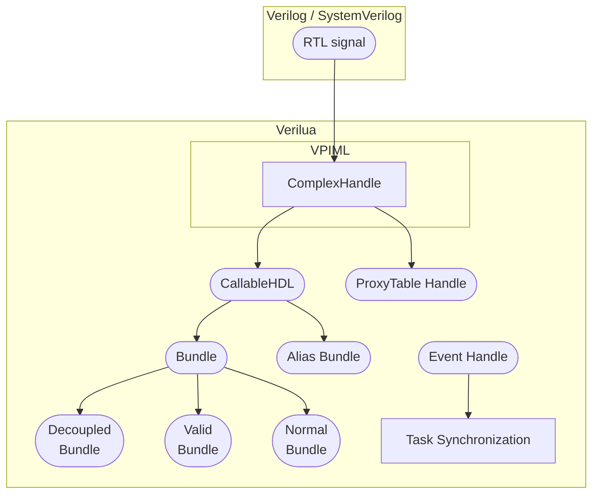

# 数据结构概览

在 `Verilua` 中，硬件信号通常被建模为 `Handle`，这也是 `Verilua` 中数据结构的主要命名方式。常见的数据结构包括：

1. [CallableHDL(`chdl`)](./callable_hdl.mdx)

   与信号进行操作的一个底层数据结构，提供了信号赋值和读取等接口，其中还包括了各种硬件信号相关的 Meta 信息，例如 width、hierarchy path。

2. [Bundle(`bdl`)](./bundle.mdx)

   一种将多个信号封装在一起的数据结构，参考了 `Chisel` 的概念，因此支持 Decoupled 和 Valid 等子类型，能够统一管理多个 `chdl`。

3. [AliasBundle(`abdl`)](./alias_bundle.mdx)

   一种特殊的 `bdl`，允许用户为信号组中的部分信号提供**别名**，从而提高代码可读性，同时仍支持对底层 `chdl` 的直接访问。

4. [ProxyTableHandle(`dut`)](./proxy_table_handle.mdx)

   通过全局 ProxyTable 智能解析路径（hierarchy path），支持与 `chdl` 几乎相同的信号操作接口，用户可直接访问信号，无需显式构造 `chdl` 或 `bdl`，简化访问复杂性，提升代码灵活性和可维护性。但是这种访问方式的设计之初主要是为了快速的临时访问信号，因此性能是不如 `chdl` 的。

5. [EventHandle(`ehdl`)](./event_handle.mdx)

   用于任务同步与通信，通过事件机制实现任务间的协调，用户可创建不同 `ehdl` 来同步任务执行顺序。需要注意的是，Event Handle 并非用于直接操作信号，而是用于管理任务之间的同步与通信，确保任务按预期顺序执行。

下面的 Mermaid 图与下方原图保持同一组概念关系，主要用于快速浏览各数据结构之间的联系：

<figure>
  
  <figcaption>Verilua data structure</figcaption>
</figure>

## 导航

- [CallableHDL](./callable_hdl.mdx)：信号句柄的创建、读写、验证、回调与自动格式识别接口。
- [Bundle](./bundle.mdx)：普通 Bundle 与 Decoupled Bundle 的创建和批量操作接口。
- [AliasBundle](./alias_bundle.mdx)：带别名的信号组创建方式与格式化输出接口。
- [ProxyTableHandle](./proxy_table_handle.mdx)：全局 `dut` 的路径解析、便捷读写和自动 Bundle 能力。
- [EventHandle](./event_handle.mdx)：任务同步事件句柄的定位说明。

## 相关文档

- [BitVec](../bitvec.mdx)：位向量类型，以及 `CallableHDL:get_bitvec()` 的返回类型说明。
- [String Literal Constructor Pattern (SLCP)](../slcp.mdx)：通过字符串字面量构建 `chdl`、`bdl`、`abdl` 等对象的统一模式。
- [多任务系统](../multi_task.mdx#task-synchronization)：`EventHandle` 在任务同步中的典型使用方式。
