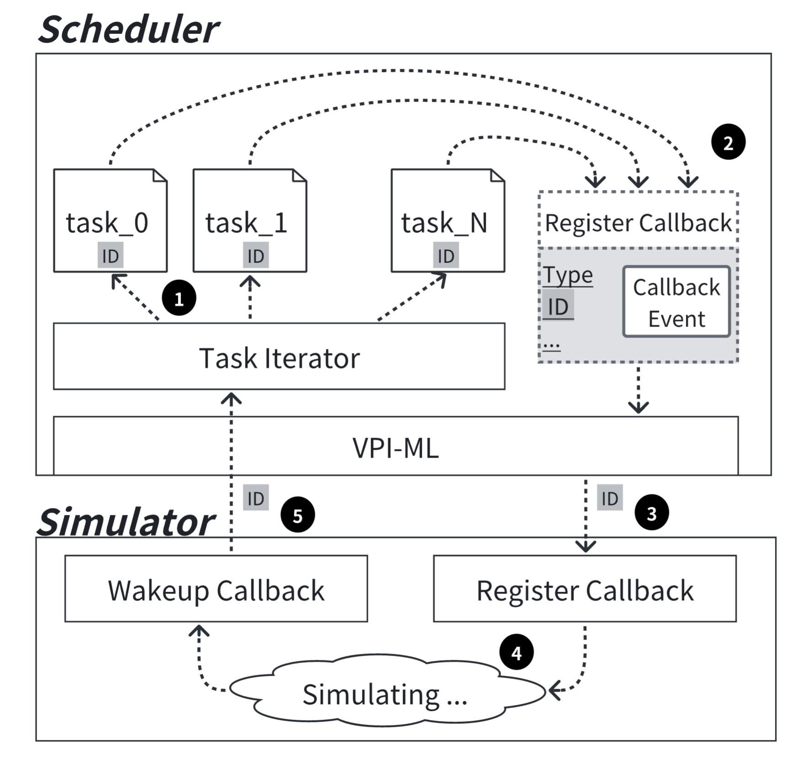

# 多任务系统

Verilua 实现了一个基于事件轮询调度的调度器（Scheduler），用于管理和记录用户注册的任务，Verilua 通过这种调度系统来实现多任务的调度。
在具体实现上，每个任务在执行到特定事件时，会通过 Scheduler 注册对应的回调函数（callback），并主动让出控制权，直到回调函数被触发后由 Scheduler 唤醒。这种协作式多任务模型依赖于任务的主动控制权让出，任务在让出控制权时可指定回调类型，例如上升沿（posedge）或下降沿（negedge）等。Scheduler 采用 Round Robin 仲裁策略，确保所有注册任务能够公平地获得执行机会，从而在单线程环境中实现高效的任务调度与并发执行。

下图是 Verilua 的任务调度流程，可以分为五个步骤：

1. Scheduler 遍历所有已注册的任务，每个任务通过唯一的 Task ID 进行标识；
2. 进入到其中一个任务中执行，执行特定位置让出任务控制权并提供回调类型与 Task ID进行回调注册；
3. Scheduler 通过 VPI-ML（Verilua 定义的一个中间层）与仿真器交互，控制仿真器注册指定的回调函数；
4. 回调函数注册后，仿真器继续运行，直到回调触发；
5. 仿真器在特定时间点触发回调后，通过 Task ID 定位对应任务，并恢复任务执行。

<figure markdown="span">
  { width="70%" }
  <figcaption>Scheduler workflow</figcaption>
</figure>

这一过程实现了任务的调度，且回调注册是异步的，任务无需等待回调完成即可继续执行其他任务，任务之间不存在依赖运行。

