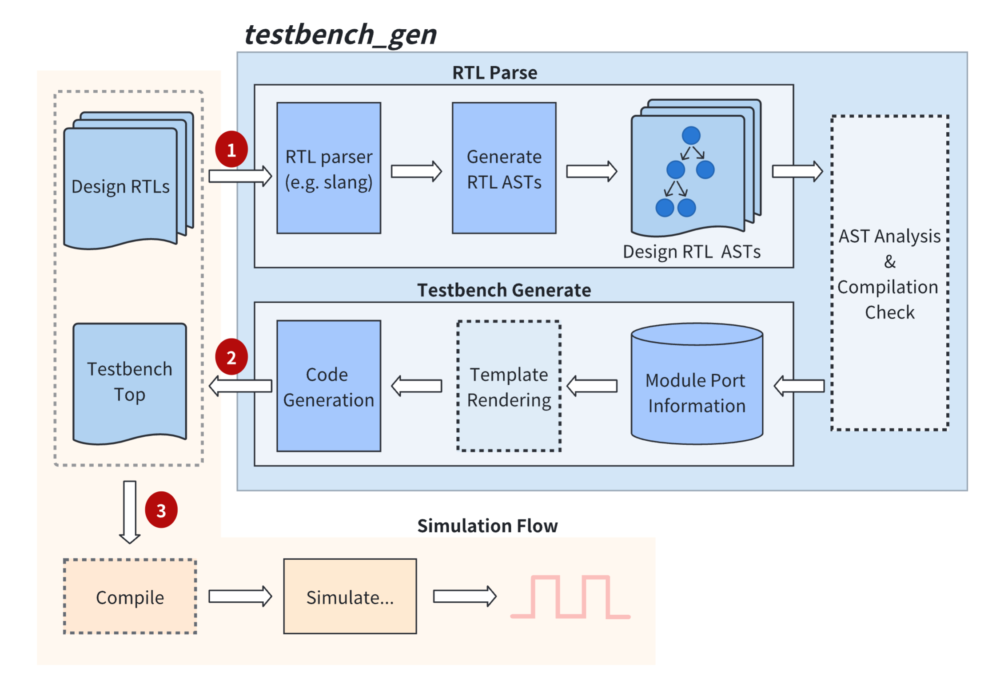

# Testbench 自动生成流程

Verilua 中，Testbench 是全自动生成的 `testbench_gen` 工具实现（安装 Verilua 的时候会编译生成 `testbench_gen`），其核心功能包括顶层模块的例化、时钟驱动、波形控制等。具体工作流程如下图所示：

<figure markdown="span">
  { width="100%" }
  <figcaption>Testbench generate workflow</figcaption>
</figure>

`testbench_gen` 底层使用的是 [slang](https://github.com/MikePopoloski/slang) 进行 RTL 代码的解析，下面是 `testbench_gen` 的命令行参数（高亮的为常用的选项）：

```shell title="Terminal" linenums="1" hl_lines="6-20"
OVERVIEW: testbench_gen(verilua@v2.0.0)

USAGE: testbench_gen [options] files...

OPTIONS:
  --tt,--tbtop <top module name>                      testbench top module name
  --dn,--dut-name <dut instance name>                 testbench dut inst name
  --od,--out-dir <directory>                          output directory
  --cs,--clock-signal <signal name>                   clock signal name
  --rs,--reset-signal <signal name>                   reset signal name
  --cc,--custom-code <file>                           input custom code <file>, will be inserted in the bottom of the testbench module
  --ccs,--custom-code-str <string>                    input custom code <string>, will be inserted in the bottom of the testbench module
  --cco,--custom-code-outer <file>                    input custom code <file>, will be inserted in the top of the testbench module
  --ccso,--custom-code-str-outer <string>             input custom code <string>, will be inserted in the top of the testbench module
  --lm,--lua-meta-file <file>                         output lua meta file(type annotation file)
  --fl,--filelist <file/filelist>                     input file or filelist
  -p,--period <period value>                          clock period
  --vb,--verbose                                      verbose output
  --co,--check-output                                 check output
  --dr,--dryrun                                       do not generate testbench
  -r,--regen                                          force regeneration of testbench
  --nd,--nodpi                                        disable dpi generation
  -h,--help                                           Display available options
  --std (1800-2017 | 1800-2023 | latest)              The version of the SystemVerilog language to use
  -I,--include-directory,+incdir <dir-pattern>[,...]  Additional include search paths
  --isystem <dir-pattern>[,...]                       Additional system include search paths
  -D,--define-macro,+define <macro>=<value>           Define <macro> to <value> (or 1 if <value> ommitted) in all source files
  -U,--undefine-macro <macro>                         Undefine macro name at the start of all source files
  --max-include-depth <depth>                         Maximum depth of nested include files allowed
  --libraries-inherit-macros                          If true, library files will inherit macro definitions from the primary source files. --single-unit must also be passed when this option is used.
  --enable-legacy-protect                             If true, the preprocessor will support legacy protected envelope directives, for compatibility with old Verilog tools
  --translate-off-format <common>,<start>,<end>       Set a format for comment directives that mark a region of disabled source text. The format is a common keyword, a start word, and an end word, each separated by commas. For example, 'pragma,translate_off,translate_on'
  --cmd-ignore <vendor_cmd>,<N>                       Define rule to ignore vendor command <vendor_cmd> with its following <N> parameters.
                                                      A command of the form +xyz will also match any vendor command of the form +xyz+abc,
                                                      as +abc is the command's argument, and doesn't need to be matched.
  --cmd-rename <vendor_cmd>,<slang_cmd>               Define rule to rename vendor command <vendor_cmd> into existing <slang_cmd>
  --ignore-directive <directive>                      Ignore preprocessor directive and all its arguments until EOL
  --max-parse-depth <depth>                           Maximum depth of nested language constructs allowed
  --max-lexer-errors <count>                          Maximum number of errors that can occur during lexing before the rest of the file is skipped
  -j,--threads <count>                                The number of threads to use to parallelize parsing
  -C <file-pattern>[,...]                             One or more files containing independent compilation unit listings. The files accept a subset of options that pertain specifically to parsing that unit and optionally including it in a library.
  --max-hierarchy-depth <depth>                       Maximum depth of the design hierarchy
  --max-generate-steps <steps>                        Maximum number of steps that can occur during generate block evaluation before giving up
  --max-constexpr-depth <depth>                       Maximum depth of a constant evaluation call stack
  --max-constexpr-steps <steps>                       Maximum number of steps that can occur during constant evaluation before giving up
  --constexpr-backtrace-limit <limit>                 Maximum number of frames to show when printing a constant evaluation backtrace; the rest will be abbreviated
  --max-instance-array <limit>                        Maximum number of instances allowed in a single instance array
  --max-udp-coverage-notes <limit>                    Maximum number of UDP coverage notes that will be generated for a single warning about missing edge transitions
  --compat vcs                                        Attempt to increase compatibility with the specified tool
  -T,--timing min|typ|max                             Select which value to consider in min:typ:max expressions
  --timescale <base>/<precision>                      Default time scale to use for design elements that don't specify one explicitly
  --allow-use-before-declare                          Don't issue an error for use of names before their declarations
  --ignore-unknown-modules                            Don't issue an error for instantiations of unknown modules, interface, and programs
  --relax-enum-conversions                            Allow all integral types to convert implicitly to enum types
  --relax-string-conversions                          Allow string types to convert implicitly to integral types
  --allow-hierarchical-const                          Allow hierarchical references in constant expressions
  --allow-toplevel-iface-ports                        Allow top-level modules to have interface ports
  --allow-recursive-implicit-call                     Allow implicit call expressions to be recursive function calls
  --allow-bare-value-param-assigment                  Allow module parameter assignments to elide the parentheses
  --allow-self-determined-stream-concat               Allow self-determined streaming concatenation expressions
  --allow-merging-ansi-ports                          Allow merging ANSI port declarations with nets and variables declared in the instance body
  --lint-only                                         Only perform linting of code, don't try to elaborate a full hierarchy
  --disable-instance-caching                          Disable the use of instance caching, which normally allows skipping duplicate instance bodies to save time when elaborating
  --disallow-refs-to-unknown-instances                When using --ignore-unknown-modules, explicitly disallow references to ignored module instances by issuing an error
  --top <name>                                        One or more top-level modules to instantiate (instead of figuring it out automatically)
  -G <name>=<value>                                   One or more parameter overrides to apply when instantiating top-level modules
  -L <library>                                        A list of library names that controls the priority order for module lookup
  --defaultLibName <name>                             Sets the name of the default library
  -W <warning>                                        Control the specified warning
  --color-diagnostics                                 Always print diagnostics in color. If this option is unset, colors will be enabled if a color-capable terminal is detected.
  --diag-column                                       Show column numbers in diagnostic output
  --diag-location                                     Show location information in diagnostic output
  --diag-source                                       Show source line or caret info in diagnostic output
  --diag-option                                       Show option names in diagnostic output
  --diag-include-stack                                Show include stacks in diagnostic output
  --diag-macro-expansion                              Show macro expansion backtraces
  --diag-abs-paths                                    Display absolute paths to files in diagnostic output
  --diag-hierarchy always|never|auto                  Show hierarchy locations in diagnostic output
  --diag-json <file>                                  Dump all diagnostics in JSON format to the specified file, or '-' for stdout
  --error-limit <limit>                               Limit on the number of errors that will be printed. Setting this to zero will disable the limit.
  --suppress-warnings <file-pattern>[,...]            One or more paths in which to suppress warnings
  --suppress-macro-warnings <file-pattern>[,...]      One or more paths in which to suppress warnings that originate in macro expansions
  --single-unit                                       Treat all input files as a single compilation unit
  -v,--libfile <file-pattern>[,...]                   One or more library files, which are separate compilation units where modules are not automatically instantiated
  --libmap <file-pattern>[,...]                       One or more library map files to parse for library name mappings and file lists
  -y,--libdir <dir-pattern>[,...]                     Library search paths, which will be searched for missing modules
  -Y,--libext,+libext <ext>                           Additional library file extensions to search
  --exclude-ext <ext>                                 Exclude provided source files with these extensions
  -f <file-pattern>[,...]                             One or more command files containing additional program options. Paths in the file are considered relative to the current directory.
  -F <file-pattern>[,...]                             One or more command files containing additional program options. Paths in the file are considered relative to the file itself.
  --dfa-unique-priority                               Respect the 'unique' and 'priority' keywords when analyzing data flow through case statements
  --dfa-four-state                                    Require that case items cover X and Z bits to assume full coverage in data flow analysis
  --allow-multi-driven-locals                         Allow subroutine local variables to be driven from multiple always_comb/_ff blocks
  --allow-dup-initial-drivers                         Allow signals driven in an always_comb or always_ff block to also be driven by initial blocks
  --max-case-analysis-steps <steps>                   Maximum number of steps that can occur during case analysis before giving up
  --max-loop-analysis-steps <steps>                   Maximum number of steps that can occur during loop analysis before giving up
```

## 多时钟配置

当设计包含多个时钟信号时，`testbench_gen` 提供了灵活的配置选项来处理不同的时钟场景：

### 时钟信号识别规则

`testbench_gen` 会按照以下优先级识别主时钟信号：

1. **用户指定的时钟信号**：通过 `--clock-signal` 参数明确指定的时钟信号名称
2. **默认时钟信号名称**：按优先级自动识别以下信号名称：
   - `clock`
   - `clock_i`
   - `clk`
   - `clk_i`
   - `i_clk`

如果设计中存在多个匹配的时钟信号，`testbench_gen` 会选择优先级最高的信号作为主时钟。

### 禁用内部时钟生成

对于多时钟设计，通常需要禁用 `testbench_gen` 的内部时钟自动生成功能，然后在用户代码中手动管理所有时钟信号。

在 xmake.lua 中配置：

```lua
-- 禁用内部时钟生成
set_values("cfg.no_internal_clock", "1")
```

### 多时钟使用示例

假设设计有以下时钟信号：
- `sys_clk`：系统主时钟
- `uart_clk`：UART 时钟
- `mem_clk`：内存时钟

配置方法：

```lua
-- 指定主时钟信号
add_values("cfg.tb_gen_flags", "--clock-signal", "sys_clk")

-- 禁用内部时钟生成
set_values("cfg.no_internal_clock", "1")
```

然后在测试代码中手动生成所有时钟：

```lua
local sys_clk = dut.sys_clk:chdl()
local uart_clk = dut.uart_clk:chdl()
local mem_clk = dut.mem_clk:chdl()

fork {
    -- 系统时钟 100MHz
    function()
        while true do
            sys_clk:set(1)
            await_time(5)  -- 5ns
            sys_clk:set(0)
            await_time(5)
        end
    end,

    -- UART 时钟 9.6MHz
    function()
        while true do
            uart_clk:set(1)
            await_time(52)  -- 52ns
            uart_clk:set(0)
            await_time(52)
        end
    end,

    -- 内存时钟 200MHz
    function()
        while true do
            mem_clk:set(1)
            await_time(2.5)  -- 2.5ns
            mem_clk:set(0)
            await_time(2.5)
        end
    end
}
```

### 时钟相关参数说明

- `--clock-signal <signal_name>`：指定主时钟信号名称
- `-p,--period <period_value>`：设置主时钟周期（仅在使用内部时钟时有效）

## 内部时钟自动生成

默认情况下，`testbench_gen` 会自动在 RTL 侧生成时钟信号。这是 Verilua 的一项性能优化设计，将时钟生成放在 RTL 层面可以避免使用 Lua 任务来驱动时钟信号，从而减少任务切换的开销，提高仿真性能。

### 性能优势

**RTL 侧时钟生成**（默认）：
- 时钟信号由 SystemVerilog 的 `always` 块直接驱动
- 无需 Lua 任务参与时钟切换
- 最小的仿真开销，最佳性能表现

**Lua 侧时钟控制**（禁用内部时钟）：
- 需要创建专门的 Lua 任务来管理时钟信号
- 每个时钟边沿都需要 Lua-RTL 交互
- 增加任务切换开销，影响仿真速度, 但更加灵活

### 时钟周期配置

可以通过 tb_gen_flags 传递(xmake.lua)配置时钟周期：
```lua
add_values("cfg.tb_gen_flags", "--period", "15")
```

### 设计考虑与权衡

内部时钟自动生成在以下方面具有特点：

- **单时钟优化**：专为单时钟设计优化，提供最佳性能
- **固定波形**：生成标准的 50% 占空比方波，满足大多数应用需求
- **高效稳定**：RTL 层面的时钟生成更加稳定可靠
- **简化设计**：减少用户代码复杂度，专注于测试逻辑

### 选择建议

根据具体需求选择合适的时钟方案：

**推荐使用内部时钟的场景**：
- 单时钟设计，追求最佳仿真性能
- 标准时钟波形即可满足需求
- 对仿真速度有较高要求
- 简单到中等复杂度的测试场景

**需要禁用内部时钟的场景**：
- 多时钟设计，必须分别控制多个时钟信号
- 需要非标准时钟波形（可变占空比、复杂调制等）
- 时钟门控或动态时钟控制需求
- 异步时钟域间的精确时序控制
- 需要在运行时调整时钟参数

## 其他

Testbench 只在 HVL 场景下才需要自动生成，可以在 xmake.lua 文件中通过 `#!lua add_values("cfg.tb_gen_flags", ...)` 来添加其他的 flags 参数，例如：

```lua
add_values("cfg.tb_gen_flags", "--ignore-unknown-modules", "--verbose")
```

默认情况下，`testbench_gen` 会生成两个文件，一个是 `tb_top.sv`，另一个是 `other.sv`，其中 `tb_top.sv` 是 Testbench 文件，`other.sv` 是留给用户自定义的文件。用户可以在 `others.sv` 中自行添加其他的内容，每次重新生成 Testbench 的时候如果 `others.sv` 存在，就不会重新生成或者覆盖，因此用户可以安全地在其中添加用户自定义的内容。 部分内容如下（假设 DUT 为 `Design`）：

!!! note
    我们之前在[这里](../getting-started/simple_hvl_example.md#about-dut)简单介绍过相关的内容。

```verilog title="tb_top.sv"
// -----------------------------------------
// user custom code
//    use `--custom-code-outer/-cco <file>` to pass in the custom code file.
//       |_ e.g. `testbench_gen [...] --custom-code-outer path/to/file`
//    use `--custom-code-str-outer/-ccso <string>` to pass in the custom code string.
//       |_ e.g. `testbench_gen [...] --custom-code-str-outer "`define a 1"`
// -----------------------------------------


module tb_top;
// ...

reg clock;
reg reset;

initial begin
    clock = 0;
    reset = 1;
end

always #10 clock = ~clock;

// ...

// -----------------------------------------
// reg/wire declaration
// -----------------------------------------
reg                  inc          ; // Input
reg[7:0]             test         ; // Input
wire[7:0]            value        ; // Output

// ...

// -----------------------------------------
//  DUT module instantiate
// -----------------------------------------
Design u_Design (
    .clock   (clock  ), // direction: In         dataType: logic
    .reset   (reset  ), // direction: In         dataType: logic
    .inc     (inc    ), // direction: In         dataType: logic
    .test    (test   ), // direction: In         dataType: reg[7:0]
    .value   (value  )  // direction: Out        dataType: logic[7:0
); // u_Design

// ...

// -----------------------------------------
// other user code...
// -----------------------------------------
Others u_others(
  .clock(clock),
  .reset(reset)
);

// -----------------------------------------
// user custom code
//    use `--custom-code/-cc <file>` to pass in the custom code file.
//       |_ e.g. `testbench_gen [...] --custom-code path/to/file`
//    use `--custom-code-str/-ccs <string>` to pass in the custom code string.
//       |_ e.g. `testbench_gen [...] --custom-code-str "reg a; initial a = 1;"`
// -----------------------------------------


endmodule
```

```verilog title="other.sv"
module Others (
    input wire clock,
    input wire reset
);

// -----------------------------------------
// other user code...
// -----------------------------------------
// ...

endmodule
```
